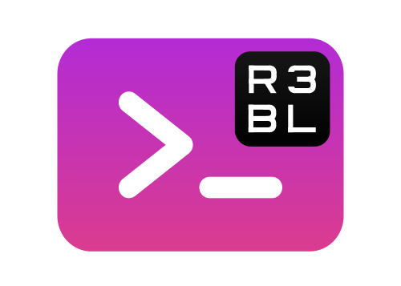

<p align="center">
  
</p>

# Contributing

<a id="markdown-contributing" name="contributing"></a>

Table of contents

<!-- TOC -->

- [Feedback](#feedback)
- [Good starting points](#good-starting-points)
  - [🦜 New to terminals?](#%F0%9F%A6%9C-new-to-terminals)
  - [🐒 New to R3BL codebase?](#-new-to-r3bl-codebase)
    - [Redux background study](#redux-background-study)
    - [TUI background study](#tui-background-study)
    - [General background study](#general-background-study)
- [Developing](#developing)
  - [Set up](#set-up)
  - [Code style](#code-style)
  - [Best practices before submitting a PR](#best-practices-before-submitting-a-pr)

<!-- /TOC -->

## Feedback

<a id="markdown-feedback" name="feedback"></a>

> ⚙️ This library crate is in service of the apps being built in the
> [r3bl-cmdr](https://github.com/r3bl-org/r3bl-cmdr/) crate / project.

While the maintainers might currently prioritize working on features, we are open to ideas and
contributions by people and projects interested in using `r3bl_rs_utils` or `r3bl-cmdr` for other
projects. Please feel free to:

1. Open an [issue](https://github.com/r3bl-org/r3bl_rs_utils/issues/new/choose).
2. Chat with us on the [r3bl discord](https://discord.gg/pG4wjDnm) in the dedicated `#r3bl_rs_utils`
   channel.

## Good starting points

<a id="markdown-good-starting-points" name="good-starting-points"></a>

If you want to get started, check out the list of
[issues](https://github.com/r3bl-org/r3bl-cmdr/issues) with the
["good first issue" label](https://github.com/r3bl-org/r3bl-cmdr/issues?q=is%3Aissue+is%3Aopen+label%3A%22good+first+issue%22).

You can also browse the more information TODOs in [TODO.todo](TODO.todo) which haven't been turned
into issues yet.

> Please follow the [Rust Code of Conduct](https://www.rust-lang.org/policies/code-of-conduct) all
> the way through!

The learning path below will help you get started. These emoji below will give you a sense how
important the related information is to using the R3BL codebase.

| Command  | Description                                        |
| -------- | -------------------------------------------------- |
| 🍌       | Nice to know it exists                             |
| 🍌🍌     | Have a high level understanding of                 |
| 🍌🍌🍌   | Working knowledge                                  |
| 🍌🍌🍌🍌 | Critical - deep understanding & hands on exercises |

### 🦜 New to terminals?

<a id="markdown-%F0%9F%A6%9C-new-to-terminals%3F" name="%F0%9F%A6%9C-new-to-terminals%3F"></a>

1. 🍌🍌🍌🍌 A really good first step is taking a look at `crossterm` crate.
   - It is small and relatively straight forward to understand. This will give you good exposure to
     the underlying terminal stuff.
   - Here's a link to the repo's
     [examples](https://github.com/crossterm-rs/crossterm/tree/master/examples). Clone it, and play
     w/ some of these examples to make some changes and run them in your favorite terminal.
2. 🍌🍌 Here's some
   [documentation](https://docs.rs/r3bl_rs_utils/0.7.41/r3bl_rs_utils/tui/crossterm_helpers/index.html)
   w/ lots of background information on terminals, PTY, TTY, etc.

### 🐒 New to R3BL codebase?

<a id="markdown-%F0%9F%90%92-new-to-r3bl-codebase%3F" name="%F0%9F%90%92-new-to-r3bl-codebase%3F"></a>

#### Redux background study

<a id="markdown-redux-background-study" name="redux-background-study"></a>

1. 🍌🍌🍌 A great starting point is the [redux](https://github.com/r3bl-org/r3bl_rs_utils#redux)
   section.
2. 🍌🍌🍌🍌 This [repo](https://github.com/r3bl-org/address-book-with-redux-tui/releases/tag/1.0) is
   a good one to start working on first.
   - This app was intended to be a pedagogical example.
   - This repo is for a simple address book CLI app that does _NOT_ have TUI support. But it does
     have _Redux_ support. So you don't have to learn both at the same time.
   - Check out how Redux functions here. How things work in an async manner (middlewares, etc). Run
     the code using `cargo run`, and make some changes and run it again.

#### TUI background study

<a id="markdown-tui-background-study" name="tui-background-study"></a>

1. 🍌🍌🍌🍌 A great starting point is this [tui](https://github.com/r3bl-org/r3bl_rs_utils#tui)
   section.

   - [Example of TUI only w/out layout](https://github.com/r3bl-org/r3bl-cmdr/tree/main/src/ex_app_no_layout)
   - [Example of TUI only w/ layout](https://github.com/r3bl-org/r3bl-cmdr/tree/main/src/ex_app_with_layout)

2. 🍌🍌🍌🍌 Here's a
   [repo](https://github.com/r3bl-org/address-book-with-redux-tui/releases/tag/1.0) that is a good
   one to start working on first.
   - The mission is to convert it to have support for the TUI library. This will give you a solid on
     how to build TUIs.

#### General background study

<a id="markdown-general-background-study" name="general-background-study"></a>

Here are some resources to learn more about the project itself:

- [r3bl_rs_utils repo README](https://github.com/r3bl-org/r3bl_rs_utils/blob/main/README.md).
- [r3bl-cmdr repo README](https://github.com/r3bl-org/r3bl-cmdr/blob/main/README.md).
- [Related content on developerlife.com](https://developerlife.com/category/Rust/).

## Developing

<a id="markdown-developing" name="developing"></a>

### Set up

<a id="markdown-set-up" name="set-up"></a>

This is no different than other Rust projects.

```bash
git clone https://github.com/r3bl-org/r3bl_rs_utils
cd r3bl_rs_utils
# To run the tests
cargo test
```

### Code style

<a id="markdown-code-style" name="code-style"></a>

We follow the standard Rust formatting style and conventions suggested by
[clippy](https://github.com/rust-lang/rust-clippy).

### Best practices before submitting a PR

<a id="markdown-best-practices-before-submitting-a-pr" name="best-practices-before-submitting-a-pr"></a>

Before submitting a PR make sure to run:

1. for formatting (a `rustfmt.toml` file is provided):

   ```shell
   cargo fmt --all
   ```

2. the clippy lints

   ```shell
   cargo clippy
   ```

3. the test suite

   ```shell
   cargo test
   ```
