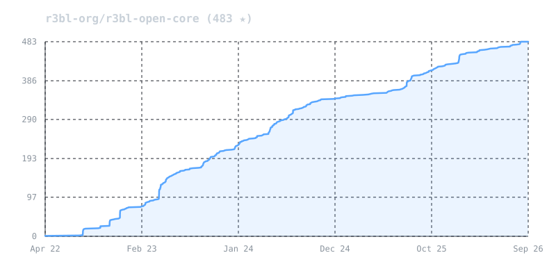

<!-- cspell:words ratatui Substeps Inclusivity inclusivity binstall intradoc warloc -->

# r3bl-open-core

<!--

-->

<!-- R3BL TUI library & suite of apps focused on developer productivity -->

<!-- prettier-ignore-start -->
```text
██████╗  ██████╗  ██████╗
██╔══██╗██╔═══██╗██╔════╝
██████╔╝██║   ██║██║
██╔══██╗██║   ██║██║
██║  ██║╚██████╔╝╚██████╗
╚═╝  ╚═╝ ╚═════╝  ╚═════╝
```
<!-- prettier-ignore-end -->

<p align="left">
  <a href="https://crates.io/crates/r3bl_tui"></a>
</p>

## Modernizing the Terminal: Taking Inspiration From Web and Desktop Apps

Despite the massive rise of AI/LLM coding agents & execution harnesses and cloud VM
administration over SSH, terminal UI innovation has largely stagnated since the 1970s.
Most CLI tools still rely on blocking single-threaded I/O, [`curses`]-era APIs, and
fragile platform hacks - or rely on the heavy, fragile workaround of layering web stacks
like [`Node.js`], [`React`], and [`ink`] onto the console. This introduces unreasonable
memory bloat, high latency, broken keyboard shortcuts, and unpredictable instability that
breaks down during long-horizon agentic workflows and sub-process orchestration.

**ROC (`r3bl-open-core`) moves the terminal forward (with love & respect) into 2026 and
beyond. ❤️**

R3BL brings modern web and desktop app design patterns to the terminal, turning it into a
place of focused productivity to build delightful, ergonomic, and rich text user interface
(TUI) experiences.

Representing years of systems programming, performance optimization, and production-grade
infrastructure design in Rust, R3BL re-imagines the terminal for the modern era - making
rich, reactive TUI applications accessible over SSH to any terminal emulator across Linux,
macOS, Windows, and Unix/BSDs (such as FreeBSD).

R3BL TUI is fundamentally different from [`vim`], [`neovim`], and [`ratatui`] through its
immediate mode reactive UI, clean separation between rendering and state mutation, and
purely async architecture - it never blocks the main thread, and natively embraces
multithreaded execution and multi-process orchestration.

### Primary Use Cases

ROC is designed to power four primary use cases:

- 🤖 **AI/LLM Coding Agents & Execution Harnesses**: Building fast, interactive terminal
  interfaces and execution harnesses for AI/LLM coding agents in pure Rust. While popular
  agent tools are written in [`Node.js`] and [`ink`] (see [origin story]), Node-based
  runtimes struggle with runaway memory consumption, fragile sub-process control, and
  unstable PTY session management when orchestrating heavy, long-running tools in
  sandboxed environments (containers, microVMs, systemd-nspawn machines, etc.).
  Furthermore, Node-based runtimes struggle with terminal input decoding, frequently
  dropping modifier keys, mangling keyboard chords, and introducing sluggish ESC key
  disambiguation lag. ROC provides a rock-solid, pure Rust foundation engineered for
  native PTY orchestration, zero-latency ANSI input decoding, deterministic process
  lifecycles, flicker-free diff rendering, and minimal resource overhead.

- ☁️ **DevOps & Cloud Workflows**: Administering modern cloud infrastructure shouldn't
  feel like using stone-age tools to build a satellite. Juggling remote VMs, containers,
  and multi-process server environments through bare terminal sessions is slow and
  error-prone. ROC transforms terminal workflows into a rich, responsive workspace with
  in-memory virtual terminal emulation, virtual tabs, 2D horizontal panning across wide
  logs, and double-buffered diff rendering that stays lag-free even over high-latency SSH
  connections.

- 📝 **Interactive Document & Markdown Workflows**: Rich interactive editing, syntax
  highlighting, and real-time code block execution directly inside Markdown documents in
  the terminal, bridging documentation directly with live operations.

- 🛠️ **Developer Productivity Infrastructure**: High-efficiency developer tooling and
  composable terminal infrastructure to enhance knowledge capture, eliminate friction, and
  streamline everyday command-line workflows.

The framework supports the full spectrum from CLI to inline dialogs to full-screen TUI and
terminal multiplexing experiences with deep systems integration.

### ROC Workspace Architecture: Core Engine, Productivity Apps & Build Tools

With over 2.7M downloads across crates.io, ROC (`r3bl-open-core`) provides
production-grade systems infrastructure across five specialized crates:

| Crate                                 | Purpose                                                                       |
| :------------------------------------ | :---------------------------------------------------------------------------- |
| **[`r3bl_tui`]**                      | Core foundational async TUI engine, reactive runtime & PTY primitives         |
| **[`r3bl-cmdr`]**                     | Suite of productivity apps (`giti`, `edi`, `env-source`)                      |
| **[`r3bl-build-infra`]**              | Developer infrastructure & build tools (`cargo-rustdoc-fmt`, `spawny`)        |
| **[`r3bl-rust-analyzer-mcp-server`]** | High-performance std-thread rust-analyzer MCP server for coding agents & IDEs |
| **[`r3bl_analytics_schema`]**         | Shared schema for privacy-first analytics & upgrade checks                    |

### Built-from-Scratch Primitives: The Four Pillars of `r3bl_tui`

At the heart of ROC is **`r3bl_tui`**, which provides four foundational interaction
primitives designed from the ground up in pure Rust:

1. 📟 **CLI & REPLs (`readline_async`)**: Unlike GNU [`readline`] which is single-threaded
   and blocking, our implementation is fully async, interruptable, and non-blocking,
   allowing background spinners and tasks to print concurrently without pausing line
   editing or blocking your main thread.

2. 📑 **Inline / Partial TUI (`choose`)**: Single-shot interactive multi-select dialogs
   that enter raw mode and render inline in terminal scrollback without taking over the
   screen or disrupting the back buffer (similar to `fzf` in spirit).

3. 🖥️ **Full-Screen TUI**: Complete raw mode with alternate screen support, fully async
   and panic-safe terminal restoration. Build [React] and [Elm] inspired apps with
   [unidirectional data flow], [responsive] [flexbox] layouts, [declarative] [CSS-like]
   styling, reactive state architecture, reusable modal dialogs with asynchronous
   autocomplete, and a full-featured Markdown editor component with custom parser, custom
   syntax highlighter, and fast zero-copy gap buffer.

4. 🔀 **Terminal Multiplexing & PTY**: In-memory virtual terminals, virtual terminal tabs,
   deterministic process orchestration, and multiplexing primitives (build your own
   [`tmux`] or sandboxed AI/LLM coding agent execution harness) featuring 2D horizontal
   viewport panning and decoupled throughput.

**Power via Composition**: Designed to be [loosely coupled and strongly coherent], you can
pick and choose only what you need or compose them seamlessly within a single application.
Transition smoothly from a non-blocking `readline_async` prompt into an inline `choose`
menu, launch a full-screen TUI for complex tasks, or orchestrate background PTY
subprocesses, all sharing application state without process restarts.

### Automated Headless Testing & Benchmarking

The entire framework across all 4 pillars is testable across Linux, macOS, and Windows.
Powered by our own PTY pillar, real production code runs headlessly in an isolated virtual
terminal environment, enabling end-to-end testing of interactive apps without requiring
human interaction:

- **PTY Automated Interactive Testing**: Enables end-to-end testing of interactive apps
  via headless PTY subprocess orchestration with the `generate_pty_test!` macro. Automate
  key sequences, window resizing, and screen output verification in completely isolated
  child processes without someone having to sit and manually type at a keyboard.
- **Visual UI Snapshot Testing**: Everything renders to an offscreen buffer (`OfsBuf`),
  providing built-in visual snapshot testing. Easily diff and assert the actual rendered
  terminal screen state headlessly generated in a real PTY environment.
- **Sans-IO In-Memory Terminal**: Pure functional VT-100 parser verifying virtual terminal
  screen buffers directly in RAM with zero OS syscalls.
- **Decoupled I/O Devices**: `InputDevice` and `OutputDevice` abstract terminal I/O away
  from physical `stdin` and `stdout`, allowing input events and output streams to be
  driven and inspected directly in tests without taking over your terminal.
- **Empirical Benchmarking & Flamegraph Profiling**: Continuous performance measurement
  via Rust's built-in benchmarking suites and automated flamegraph profiling against
  established baselines rather than guesswork.

### Engineered for Performance, Correctness & Reliability

- 📐 **Zero-Cost Type-Proof Architecture & Mathematical Correctness**: Rather than relying
  on ambiguous primitive integers (`usize`, `u16`) and runtime assertions, formal type
  theory and trait hierarchies [make illegal states unrepresentable]:
    - **The Newtype Pattern for Domain Separation & Coordinate Safety**: Replaces raw
      primitive integers with zero-cost newtypes (`CRow`, `VPRow`, `CHeight`), eliminating
      primitive obsession and transposition bugs with zero runtime memory or performance
      overhead:
        - **0-Index vs 1-Index Separation**: Strongly types the distinction between
          0-based buffer positions (`IndexOps`: `VPRow`, `VPCol`, `CRow`, `CCol`), 1-based
          terminal coordinates (`TermRow`, `TermCol`), and 1-based lengths (`LengthOps`:
          `VPHeight`, `VPWidth`, `CHeight`, `CWidth`).
        - **Safe Bidirectional Conversions**: Pairing traits provide explicit conversions
          between 0-based and 1-based domains (`to_zero_based()`, `from_zero_based()`,
          `convert_to_length()`).
        - **Algebraic Identities & CSI Zero Protection**: Enforces algebraic laws
          (`Index + Length = Index`, `Index - Index = Length`) to eliminate dangerous
          manual arithmetic on raw integers, preventing off-by-one errors (`<` vs `<=`),
          negative underflow, and CSI zero-index terminal crashes (`TermRowDelta`,
          `TermColDelta`).
        - **Empirically Proven Zero-Cost Layout**: Newtypes share the identical memory
          layout, size, and ABI of raw primitives (passed in CPU registers with zero heap
          allocation or indirection) and are completely erased during LLVM compilation;
          Criterion benchmarks confirm execution differences remain strictly within the
          +/- 2% noise margin ([FUNARCH 2026][FUNARCH 2026 paper]).
    - **Dual-Domain Coordinate Trait Hierarchy**: Strict trait boundaries isolate 64-bit
      memory coordinates (`StorageCoordinate`, `usize`: `CPos`) from 16-bit visual
      coordinates (`ScreenCoordinate`, `u16`: `VPPos`), requiring explicit camera viewport
      transformations.
    - **Explicit Narrowing/Widening Traits & Zero Raw `as` Casts**: Replaces dangerous,
      silent primitive `as` casting across the codebase with explicit, type-safe traits
      (`WideningCastTo` for lossless promotions and `NarrowingCastTo` for checked/clamped
      reductions), preventing accidental truncations and sign-loss bugs.
    - **Eliminating Boolean Blindness with Witness Enums**: Grounded in ACM research
      ([FUNARCH 2023][FUNARCH 2023 paper] and [Parse, don't validate]), boundary and
      bounds checks never return uninformative `bool` flags. Instead, they return
      structured witness enums (`ArrayOverflowResult`, `RangeBoundsResult`), forcing
      callers to exhaustively handle all boundary states at compile time.

- 🦄 **First-Class Unicode & Complex Emoji Engine (`GCString`)**: Most terminal emulators
  and TUI libraries break when handling "jumbo emojis", zero-width joiners (ZWJ), skin
  tone modifiers, and wide characters (display width > 1), causing visual tearing,
  misaligned borders, and string-slicing panics. ROC solves this from the ground up via
  `GCStringOwned`:
    - **Tri-Index Separation**: Strictly decouples memory position (`ByteIndex`, UTF-8
      offset), logical editing position (`SegIndex`, user-perceived grapheme clusters),
      and visual column position (`VPCol`, actual terminal display width).
    - **Complex Emoji & Modifier Support**: Correctly measures and renders multi-codepoint
      sequences (e.g., `👨🏾‍🤝‍👨🏿` spans 5 codepoints and 7 code units, but resolves to 1 logical
      grapheme segment and 2 visual columns).
    - **Panic-Proof Slicing & Boundary Safety**: Guarantees cursor navigation, backspace,
      and substring slicing never split UTF-8 codepoints or mid-grapheme clusters,
      eliminating runtime slicing panics across editors, line inputs, and diff rendering.

- 🔒 **Supply-Chain Integrity & Owning Our BOM**: In an era of software supply-chain
  attacks, maintainer burnout, and abandonware, our explicit architectural goal is to
  **own our Bill of Materials (BOM)**. Critical primitives (including our custom
  `direct_to_ansi` terminal I/O backend, VT-100/ANSI parser, zero-copy gap buffer, and
  Markdown parser) are engineered in-house in pure Rust. We strictly limit external
  dependencies to actively funded, strongly supported, and battle-tested industry
  foundations (such as `tokio`, `mio`, and `mimalloc`), safeguarding production
  applications against transitive bloat, sudden deprecations, and upstream
  vulnerabilities.

- 🌍 **Multi-Backend Architecture (Linux, macOS, Windows, Unix/BSDs)**: Native,
  first-class support across platforms using the best backend for each OS:
    - **Linux**: Our custom high-performance, Linux-native `direct_to_ansi` engine
      (talking directly to the terminal device via `mio`/epoll for minimal latency and
      maximum throughput, without the use of `crossterm`).
    - **macOS, Windows & Unix/BSDs**: Currently powered by `crossterm`. We plan to expand
      `direct_to_ansi` in the future to replace `crossterm` across all platforms.

- 🚀 **SIMD Contiguous Memory Layout (`Flat2DArray`)**: Single contiguous 1D allocation
  indexed as 2D, delivering 2.3x rendering speedups, SIMD chunk batching, and eliminating
  pointer indirection ([implementation deep
  dive][High-Performance Flat 2D Arrays in Rust (SIMD, L1 Cache)] and [memory latency
  theory][Rust, Memory performance & latency]).

- 🧑‍🤝‍🧑 **Double-Buffered SSH-Optimized Diff Rendering**: Double-buffered compositor computes
  minimal cell-level diffs between frames, painting only what changed for smooth,
  flicker-free performance over high-latency SSH connections, with multi-layer Z-order
  compositing for modal overlays and popups.

- 🔀 **Terminal Multiplexing & PTY Architecture (`PTYMux`)**: Decouples physical display
  constraints from subprocess execution via virtual terminals and process orchestration:
    - **2D Viewport Panning in PTY Sessions (Horizontal Scrolling without Wrapping)**:
      Traditional terminal emulators (like `xterm`, `Alacritty`, `Kitty`) lack horizontal
      panning for standard CLI tools (like `cat`, `grep`, `git log`, `dmesg`), forcibly
      hard-wrapping wide lines across rows and mangling tabular data, JSON, or stack
      traces into unreadable spaghetti. When running any CLI program inside a ROC PTY
      session (a concrete manifestation of which is [`pty_mux_example`], powered by
      [`GrowableBuffer`] and [`PTYMux`]), ROC decouples the physical viewport from the
      virtual terminal canvas width (e.g., 1,000+ columns). The child process writes into
      this wide virtual canvas without line wrapping, allowing users to smoothly pan
      horizontally (`Shift + Mouse Wheel` or trackpad gestures) across the output without
      layout destruction.
    - **Decoupled Throughput vs. Terminal Bottlenecks (Faster Than Bare `xterm`)**: In
      traditional terminal emulators (like `xterm`), running a command that dumps
      megabytes of text (e.g., `cat large.log`) blocks the process on `stdout` I/O while
      the terminal synchronously parses escape codes, recalculates line wrapping, and
      rasterizes every glyph. Counter-intuitively, running that same command inside a ROC
      PTY session (such as [`pty_mux_example`]) running _inside_ `xterm` is often
      significantly **faster than running the command directly in bare `xterm`**. ROC's
      headless VT-100 parser (`OfsBufVT100`) acts as an in-memory shock absorber,
      ingesting raw subprocess output at memory bus speeds, while double-buffered diff
      rendering paints only the visible viewport to the host terminal at controlled
      display intervals. Subprocesses drain `stdout` without stalling on terminal drawing
      or network I/O backpressure.

- 🕊️ **Terminfo Liberation**: Completely frees your applications from legacy `terminfo` /
  `termcap` databases and [`ncurses`] baggage by querying modern ANSI protocols directly
  at runtime.

- 📜 **`CSS`-Like Styling & Declarative Layouts**: Responsive [flexbox] layouts and
  [declarative] [CSS-like] styling inspired by [React] and [Elm].

- 🎨 **Intelligent Color Degradation**: Automatically detects terminal capabilities and
  gracefully degrades colors: **24-bit Truecolor -> 256 colors -> 16 ANSI colors ->
  Monochrome** (black & white). Gracefully handles environments lacking truecolor support
  (such as pre-macOS 26 Tahoe `Terminal.app`, Linux virtual consoles, or headless CI
  runners), complete with dynamic lolcat rainbow color-wheel palettes that automatically
  adapt to terminal color capability.

- ⌨️ **Modern Terminal Input & Keyboard Protocol Architecture**: Combines Linux-native
  kernel TTY polling via `direct_to_ansi` with an IO-free Sans-IO protocol state machine
  for robust, zero-latency input handling across local terminals and SSH:
    - **Linux-Native `direct_to_ansi` Driver**: Bypasses `crossterm` and `libc` FFI
      wrappers on Linux by talking directly to `/dev/tty` via `mio`/`epoll(7)`,
      eliminating thread-blocking reads and CPU-spinning loops.
    - **Disambiguating Modifier Chords & Key Collisions**: Reliably decodes chords and
      combinations that traditional terminal runtimes mangle or drop - such as
      [`Shift+Enter`], `Ctrl+Enter`, `Ctrl+Tab`, `Ctrl+Number/Punctuation`, `Ctrl+I` vs
      `Tab`, and `Alt+[` collisions.
    - **Kitty Keyboard Protocol (`CSI u`) Progressive Enhancement**: Negotiates advanced
      keyboard protocols with modern terminals ([Kitty keyboard protocol]), enabling full
      modifier reporting, key-release events, and unambiguous key sequences with graceful
      legacy fallback.
    - **Zero-Latency ESC Disambiguation (`MaybeMore`)**: Replaces brittle 50-100ms timeout
      heuristics with an internal state machine (`KernelDrained`, `KernelMayHaveMore`),
      achieving 0ms zero-latency ESC handling while correctly reassembling multi-packet
      escape sequences across SSH.
    - **OSC Terminal Query Absorption & SGR Mouse Reporting**: Frames and absorbs
      background terminal responses (such as OSC 10/11 color queries and OSC 52 clipboard)
      on `stdin` to prevent terminal text leakage, while supporting full SGR mouse
      tracking (clicks, drags, scroll wheel).

- 🧩 **Composable "Applet" Architecture & Shared State**: Enables multiple integrated TUI
  experiences ("applets") to run within the same process and terminal window. Supports
  shared application state across sub-apps alongside local view state, allowing seamless
  transitions and routing between Full-Screen TUI views and inline Partial-TUI dialogs
  without process restarts or lost context.

## Welcome to the monorepo and workspace

All the crates in the `r3bl-open-core` [monorepo] provide lots of useful functionality to
help you build TUI (text user interface) apps, along with general niceties & ergonomics
that all Rustaceans 🦀 can enjoy 🎉.

Any top-level folder in this repository that contains a `Cargo.toml` file is a Rust
project, also known as a [crate]. These crates are likely published to [crates.io].
Together, they form a [Rust workspace].

Here's the [changelog] for this monorepo containing a Rust workspace. The changelog is a
great place to start to get familiar with what has changed recently in each of the crates
in this Rust workspace.

## This workspace contains crates for building TUI, CLI, TTY apps

The [`r3bl_tui`] crate is the main crate that contains the core functionality for building
TUI apps. It allows you to build apps that range from "full" TUI to "partial" TUI, and
everything in the middle.

Here are some videos that you can watch to get a better understanding of TTY programming.

- [Build with Naz: TTY playlist]
- [Build with Naz: async readline]

This crate provides five entry points for building interactive terminal applications. Each
internalizes terminal availability and size checks, and returns a `TuiAvailability<T>`
enum:

| Entry Point                         | Purpose                | Best For                                                               |
| :---------------------------------- | :--------------------- | :--------------------------------------------------------------------- |
| `TerminalWindow::main_event_loop()` | Full TUI framework     | Complex, multi-component apps with layouts, dialogs, and custom logic. |
| `ReadlineAsyncContext::try_new()`   | Async Readline         | CLI-style line input, REPLs, and background logging.                   |
| `choose()`                          | Interactive Selection  | Prompting user to select one or more items from a list.                |
| `PTYMuxBuilder::build()`            | Terminal Multiplexer   | Wrapping existing CLI tools (like `htop`, `bash`) in a multi-pane TUI. |
| `Spinner::try_start()`              | Indeterminate Progress | Long-running tasks needing visual feedback (standalone or embedded).   |

### Full TUI (async, raw mode, full screen) for immersive TUI apps

[`tui`] gives you "raw mode", "alternate screen" and "full screen" support, while being
totally async. It provides a full-featured framework with:

- **`App` trait**: Unidirectional data flow architecture.
- **`FlexBox`**: Responsive layout engine.
- **Component System**: Reusable UI elements (editors, dialogs, etc.).

An example of this is the "Full TUI" app `edi` in the [`r3bl-cmdr`] crate. You can install
& run this with the following command:

```bash
cargo install r3bl-cmdr
edi
```

### Partial TUI (async, partial raw mode, async readline) for choice based user interaction

[`choose`] allows you to build less interactive apps that ask a user to make choices from
a list of options and then use a decision tree to perform actions.

An example of this is this "Partial TUI" app `giti` in the [`r3bl-cmdr`] crate. You can
install & run this with the following command:

```bash
cargo install r3bl-cmdr
giti
```

### Partial TUI (async, partial raw mode, async readline) for async REPL

[`readline_async`] gives you the ability to easily ask for user input in a line editor.
You can customize the prompt, and other behaviors, like input history.

Using this, you can build your own async shell programs using "async readline & `stdout`".
Use advanced features like showing indeterminate progress spinners, and even write to
`stdout` in an async manner, without clobbering the prompt / async readline, or the
spinner. When the spinner is active, it pauses output to `stdout`, and resumes it when the
spinner is stopped.

An example of this is this "Partial TUI" app `giti` in the [`r3bl-cmdr`] crate. You can
install & run this with the following command:

```bash
cargo install r3bl-cmdr
giti
```

Here are other examples of this:

1. [`tcp-api-server`]: An interactive async REPL client demonstrating `readline_async`
   with concurrent background tasks and progress spinners.
2. [`tui/examples`]: Standalone examples in this workspace demonstrating async readline
   (`readline_async.rs`), spinners (`spinner.rs`), shell (`shell_async.rs`), and PTY
   orchestration.

### Terminal multiplexer

[`PTYMux::run()`] lets you build a terminal multiplexer similar to `tmux`. It manages
multiple child processes (each in its own PTY) with per-process virtual terminal buffers
and instant switching. See the [`pty_mux_example`] for a working example that wraps
`bash`, `htop`, and other CLI tools.

## Power via composition

You can mix and match "Full TUI" with "Partial TUI" to build for whatever use case you
need. `r3bl_tui` allows you to create application state that can be moved between various
"applets", where each "applet" can be "Full TUI" or "Partial TUI".

### Main library crate

There is just one main library crate in this workspace: [`r3bl_tui`].

To add `r3bl_tui` to your own Rust project:

**Option 1: crates.io (stable release)**

Use this if you prefer stable, versioned releases:

```bash
cargo add r3bl_tui
```

Or in your `Cargo.toml`:

```toml
[dependencies]
r3bl_tui = "0.7.8"
```

**Option 2: GitHub main branch (bleeding edge)**

Bug fixes and patches land on `main` immediately before being published to crates.io. If
you need the latest fixes or rapid iteration:

```bash
cargo add r3bl_tui --git https://github.com/r3bl-org/r3bl-open-core.git --branch main
```

Or in your `Cargo.toml`:

```toml
[dependencies]
r3bl_tui = { git = "https://github.com/r3bl-org/r3bl-open-core.git", branch = "main" }
```

### Main binary crate

There is just one main binary crate that contains user facing apps that are built using
the library crates: [`r3bl-cmdr`]. This crate contains these apps:

- `giti`: Interactive git workflows made easy.
- `edi`: Beautiful Markdown editor with advanced rendering and editing features.
- `env-source`: Fast cross-platform environment loader evaluating scripts across POSIX sh,
  Fish, PowerShell, and cmd.exe.

You can install & run this with the following command:

```bash
cargo install r3bl-cmdr
# Interactive git workflows made easy.
giti --version
# Beautiful Markdown editor with advanced rendering and editing features.
edi --version
# Fast cross-platform environment loader.
env-source --version
```

### Build infrastructure and developer tooling crate

The [`r3bl-build-infra`] crate provides developer productivity tools:

- `cargo-rustdoc-fmt`: Formats markdown tables and converts inline links to
  reference-style links in rustdoc comments.

You can install this binary with:

```bash
cargo install r3bl-build-infra
# Or from local source within this workspace:
fish run.fish install-build-infra
```

## Project Task Organization

This project uses a task management system for organizing day-to-day development work
using detailed task files with implementation plans in the `./task/` directory.

### Task Management Files

- **[`./task/`]** - Directory containing detailed task management files:
    - **Active tasks**: `task_*.md` files in root of `./task/` - Complex tasks currently
      in progress
    - **`pending/`**: Tasks queued for later work
    - **`done/`**: Completed task files moved from root after all steps are marked
      `[COMPLETE]`
    - **`archive/`**: Abandoned tasks retained for historical reference
    - **`AGENTS.md`**: Rules and format specifications for creating and maintaining task
      files

### Task File Format

Detailed task files follow a structured format defined in [`./task/AGENTS.md`]:

**Structure:**

```markdown
# Task Overview

High-level description, architecture, context, and the "why"

# Implementation Plan

## Step 0: Do Something [STATUS]

Detailed instructions for this step

### Step 0.0: Do Subtask [STATUS]

Details about subtask

### Step 0.1: Do Another Subtask [STATUS]

Details about another subtask

## Step 1: Do Something Else [STATUS]

More detailed steps...
```

**Hierarchical organization:**

- Steps are numbered (Step 0, Step 1, Step 2, etc.)
- Substeps use decimal notation (Step 0.0, Step 0.1, etc.)
- Table of contents automatically generated and maintained using `doctoc`
- Formatting standardized with `prettier`

**Status markers:**

- `[COMPLETE]` - Step finished and verified
- `[WORK_IN_PROGRESS]` - Currently working on this step
- `[BLOCKED]` - Cannot proceed (waiting for dependency)
- `[DEFERRED]` - Postponed to later

### Task Workflow Commands

The `/r3bl-task` slash command (defined in [`AGENTS.md: task-tracking-system`]) manages
the task lifecycle:

**Create a new task:**

```bash
/r3bl-task create my_feature_name
```

- Creates `./task/task_my_feature_name.md` from your detailed plan
- Use after you have a comprehensive plan in your todo list
- Initializes structure with steps and status markers

**Update an existing task:**

```bash
/r3bl-task update my_feature_name
```

- Updates progress markers in `./task/task_my_feature_name.md`
- Moves completed task files to `./task/done/` when all steps are `[COMPLETE]`

**Resume working on a task:**

```bash
/r3bl-task load my_feature_name
```

- Loads `./task/task_my_feature_name.md` for continued work
- Resumes from the last step marked `[WORK_IN_PROGRESS]`
- If none found, asks which incomplete step to start with

### Workflow Connection

The task organization workflow connects strategic planning with tactical execution:

- **Strategic Planning** (`docs/` folder): Feature roadmaps, architectural decisions,
  design documents
- **Planning to Active Work**: Complex features are documented in `docs/` first.
- **Tactical Execution**:
    1. Complex tasks get detailed planning → `/r3bl-task create` → `./task/task_*.md`
    2. Work progresses through hierarchical steps with `/r3bl-task update` marking
       progress
    3. Completion → Task moved to `./task/done/` via `/r3bl-task update`

This approach (docs → ./task/) ensures strategic planning, tactical planning, and detailed
execution are well-organized and connected.

### Development Tools Integration

R3BL provides IDE extensions to enhance your development workflow:

**For VSCode Users**

R3BL provides custom VSCode extensions including Task Spaces (organize editor tabs by
context), theme, and enhanced syntax highlighting. See the [R3BL VSCode Extensions]
section below for installation and detailed feature descriptions.

**Workflow Integration:**

The R3BL Task Spaces extension helps you organize editor tabs by context (e.g., one space
for features, one for docs, one for debugging) while the `./task/` files track your
implementation progress.

## Documentation and Planning

We invest heavily in documentation quality because it is the right thing to do. Also,
[research shows] it is the single most important factor developers consider when
evaluating open source projects. In the Rust ecosystem specifically, documentation is the
#1 crate evaluation criterion ([RFC 1824]), and 91% of practitioners depend on
documentation for adoption decisions ([2024 study]). Every public API has rustdoc comments
with usage examples, and doc tests verify that every example compiles and runs.

Our documentation standards are not aspirational - they are [machine-enforced].
Conventions for voice, structure, links, and formatting are codified as an AI (LLM) skill
that runs during development, not a style guide that sits in a wiki collecting dust. We
also operationalize inclusivity at the documentation level: our [Pedagogical Links for
Inclusivity] rule requires linking domain-specific terms to external references so no
reader is excluded by assumed knowledge - a concrete, measurable practice rather than a
vague aspiration.

The [`docs/`] folder contains comprehensive documentation for this project, including:

### Documentation Philosophy

- [`why-good-docs-matter.md`] - Research evidence for why we invest heavily in
  documentation quality

### Release and Contribution Guides

- [`release-guide.md`] - Step-by-step guide for releasing new versions
- [`contributing_guides/`] - Detailed contribution guidelines including:
    - Branch naming conventions (`BRANCH.md`)
    - Commit message standards (`COMMIT_MESSAGE.md`)
    - Issue creation guidelines (`ISSUE.md`)
    - Pull request procedures (`PULL_REQUEST.md`)
    - Code style guide (`STYLE_GUIDE.md`)

### Technical Design Documents

- Parser strategy analysis and design decisions
- Performance optimization guides (`docs/task_tui_perf_optimize.md`)
- Architecture documentation for various components
- Feature-specific planning and design documents

The `docs/` folder serves as the central repository for:

- **Long-term planning**: Strategic goals and feature roadmaps
- **Technical decisions**: Architecture choices and implementation strategies
- **Process documentation**: How we work and contribute to the project
- **Design artifacts**: Detailed analysis of complex features before implementation

## Learn how these crates are built, provide feedback

To learn how we built this crate, please take a look at the following resources.

- If you like consuming video content, here's our [YT channel]. Please consider
  [subscribing].

## Quick Start

### Automated Setup (Recommended)

Use the bootstrap script to automatically install all required tools:

```bash
# Clone the repository
git clone https://github.com/r3bl-org/r3bl-open-core.git
cd r3bl-open-core

# Run the bootstrap script
./bootstrap.sh
```

The [`bootstrap.sh`] script handles **OS-level setup** with a clean main function
structure and will:

- **Cross-Platform Support**: Works on **macOS** (Homebrew) and **Linux** including Ubuntu
  (apt), Fedora (dnf), Arch (pacman), openSUSE (zypper), and Alpine (apk)
- **Core Rust Installation**: Install Rust toolchain (`rustup`) and ensure `cargo` is in
  `PATH`
- **Development Shell**: Install `Fish` shell and `fzf` for interactive development
- **File Watching**: Install file watchers (`inotifywait` on Linux, `fswatch` on macOS)
- **Development Utilities**: Install `htop`, `screen`, `tmux` for system monitoring
- **Node.js Ecosystem**: Install [`Node.js`] and `npm` (for Markdown formatting via
  Prettier and local documentation serving)
- **AI (LLM) Integration (Optional)**: If you choose to use an AI coding agent, the repo
  supports `Antigravity CLI` (`agy`), or any tool of your choice
- **Rust Development Tools Setup**: Call `fish run.fish install-cargo-tools` for all
  Rust-specific `cargo` tooling

**Architecture**: Uses clear function separation with `main()` orchestrator and dedicated
functions for each concern (`install_rustup`, `install_clang`, `install_shell_tools`,
etc.)

### Manual Setup

If you prefer manual installation or are on Windows:

```bash
# Install Rust
curl --proto '=https' --tlsv1.2 -sSf https://sh.rustup.rs | sh

# Install `fish`, `fzf`, `nodejs`, and `npm` (via package manager)
# Ubuntu/Debian: sudo apt install fish fzf nodejs npm
# macOS: brew install fish fzf node
# Or run `./bootstrap.sh` for automatic detection

# Install Rust development tools (after OS dependencies)
fish run.fish install-cargo-tools
```

**Note**: The manual approach requires you to install OS-level dependencies yourself. The
`install-cargo-tools` command focuses specifically on **Rust development tools**:

**From crates.io (via cargo-binstall with fallback to cargo install):**

- **`cargo-binstall`**: Fast binary installer (installed first as foundation)
- **Core Development Tools**: `bacon`, `flamegraph`, `inferno`
- **Workspace Management**: `cargo-workspaces`, `cargo-cache`, `cargo-update`
- **Code Quality & Link Checking**: `cargo-deny`, `cargo-unmaintained`, `cargo-expand`,
  `cargo-readme`, `lychee`
- **Language Server Components**: `rust-analyzer` component, `rust-src`

**From local source (via `cargo install --path`):**

- **cmdr**: `edi`, `giti`, `rc`, `env-source` binaries (calls `run.fish install-cmdr`)
- **build-infra**: `cargo-rustdoc-fmt` (calls `run.fish install-build-infra`)
- **rust-analyzer-mcp-server**: `rust-analyzer-mcp-server` MCP binary (calls
  `run.fish install-rust-analyzer-mcp-server`)

**Features:**

- **Smart Installation**: Uses `cargo-binstall` for speed with fallback to
  `cargo install --locked`
- **Local Source Rebuild**: Always rebuilds `cmdr`, `build-infra`, and
  `rust-analyzer-mcp-server` from source with current toolchain
- **Shared Utilities**: Leverages utility functions from `script_lib.fish` for consistency

## IDE Setup and Extensions

### R3BL VSCode Extensions

For an optimal development experience with r3bl-open-core in VSCode, we provide a custom
extension pack specifically designed for Rust development. This extension pack is not
available on the VSCode marketplace and must be installed manually.

**What's included:**

- **Task Spaces** - Organize and switch between collections of editor tabs for different
  work contexts (e.g., one space for editing features, one for writing documentation, one
  for debugging). Complements the `./task/` file management system by helping you organize
  your editor sessions.
- **R3BL Theme** - A carefully crafted dark theme optimized for Rust and Markdown
  development
- **Auto Insert Copyright** - Automatically inserts copyright headers in new files
- **Semantic Configuration** - Enhanced Rust syntax highlighting with additional semantic
  tokens
- **Extension Pack** - Bundles all R3BL extensions for easy installation

**Benefits for r3bl-open-core development:**

- Zero manual configuration required
- Enhanced semantic highlighting for better code readability
- Automatic copyright header insertion following project standards
- Seamless integration with rust-analyzer
- Optimized color scheme for the r3bl codebase

**Installation:**

```bash
# Clone the extension repository
git clone https://github.com/r3bl-org/r3bl-vscode-extensions.git
cd r3bl-vscode-extensions

# Install extensions (works with both VSCode and VSCode Insiders)
./install.sh
```

**Prerequisites:**

- VSCode or VSCode Insiders installed
- Bash shell (for running install.sh)

**Post-installation:**

1. Restart VSCode
2. Select the R3BL Theme: `Ctrl+Shift+P` → "Preferences: Color Theme" → "R3BL Theme"
3. Configure copyright settings if needed

The R3BL VSCode extensions work seamlessly with the existing development tools mentioned
in this guide, including `rust-analyzer`, `bacon`, and the comprehensive development
workflow.

### AI (LLM) Coding Agent Integration (Optional)

We believe developers should be empowered to think for themselves, read & understand code,
and write code. We do not push the use of AI (LLM) coding agents or advocate "vibe
coding".

**Comprehensive Non-AI (LLM) Tooling:**

Our primary development experience is built around robust tools and scripts which don't
require LLMs. These tools are deterministic (not probabilistic), don't hallucinate, are
fast & efficient, and only consume your local compute and energy resources:

- [`./check.fish`]: Your go-to tool for builds, tests, and linting.
- [`run.fish`][unified-script-architecture]: Orchestrates workspace-wide commands.
- [`bacon`][bacon-development-tools]: Provides real-time background feedback.
- [`bootstrap.sh`][automated-setup-recommended]: Automated OS-level and toolchain setup.
- **`cargo-rustdoc-fmt`**: Custom rustdoc formatter located in the [`build-infra/`]
  folder.
- [R3BL VSCode Extensions]: Enhancements for the developer's environment (Themes,
  Copyright management, etc).
- **Core Rust Stack**: `rustup`, `cargo`, `rust-analyzer`, `clippy`, `rustfmt`.
- **CLI Power Tools**: `fzf` (fuzzy finding), `btop` (monitoring), `tmux` (multiplexing),
  `flamegraph` (profiling), `inferno` (stack collapse), `lychee` (link checking).
- **Workspace Utilities**: `cargo-binstall`, `cargo-deny`, `cargo-expand`, `cargo-update`,
  `cargo-workspaces`, `cargo-cache`, `cargo-outdated`, `cargo-unmaintained`,
  `cargo-readme`, `cargo-warloc` (count lines of code).

For those who choose to use AI (LLM) coding agents, this project is agent-agnostic and
provides structured guidance to support you in using your tool of choice. This ensures
that you can:

1. Explore the existing codebase with confidence.
2. Run tests, do profiling, and measure optimizations.
3. Refactor code or generate new code that adheres to our engineering standards. There are
   manual review steps and many other guardrails in place in the [`skills`] themselves.

**How it works:**

Using an AI coding agent is completely optional. If you do choose to use an AI/LLM coding
agent (such as `Antigravity CLI` (`agy`), or any tool of your choice), point it to the
instructions in [`AGENTS.md`]. This file contains our design philosophy, coding standards,
and crate-specific guidance.

To equip your AI coding agent with AST-aware code navigation, compiler diagnostics, and
automated quick-fixes via `rust-analyzer`, connect it to our
[`r3bl-rust-analyzer-mcp-server`] ([crates.io: r3bl-rust-analyzer-mcp-server]) Model
Context Protocol (MCP) server.

**Available Skills (`.agents/skills/`):**

When used, AI (LLM) coding agents can leverage the patterns and commands defined in the
`.agents/` directory:

| Skill                 | Purpose                                                          |
| --------------------- | ---------------------------------------------------------------- |
| `check-code-quality`  | Comprehensive quality checklist (check → build → clippy → tests) |
| `run-clippy`          | Linting, comment punctuation, cargo fmt                          |
| `write-documentation` | Rustdoc conventions, intra-doc links, constant formatting        |
| `organize-modules`    | Private modules with public re-exports pattern                   |
| `check-bounds-safety` | Type-safe Index/Length patterns for bounds-sensitive code        |
| `analyze-performance` | Flamegraph-based performance regression detection                |
| `design-philosophy`   | Core principles: cognitive load, type safety, abstraction worth  |

**Slash Commands:**

Invoke `skills` directly in your AI (LLM) coding agent:

| Command               | Action                                                                 |
| --------------------- | ---------------------------------------------------------------------- |
| `/check`              | Run comprehensive code quality checks                                  |
| `/docs`               | Documentation build and formatting                                     |
| `/clippy`             | Code style and linting                                                 |
| `/fix-intradoc-links` | Fix rustdoc intra-doc links                                            |
| `/check-regression`   | Detect performance regressions                                         |
| `/analyze-logs`       | Analyze log files (strips ANSI codes)                                  |
| `/r3bl-task`          | [Task management][R3BL VSCode Extensions] (create, update, load, done) |

**AI (LLM) Coding Agent Synergy: R3BL VSCode Extensions**

For the best experience, install the [R3BL VSCode Extensions]. They boost your
productivity whether you use them standalone or hand-in-hand with AI (LLM) coding agents.
Here are some highlights:

| Extension                    | AI (LLM) Coding Agent Synergy                                                                                                                |
| ---------------------------- | -------------------------------------------------------------------------------------------------------------------------------------------- |
| **R3BL Theme**               | Optimized dark theme for long coding sessions with AI (LLM) coding agents                                                                    |
| **R3BL Task Spaces**         | Organize editor tabs by task context — switch between feature work, debugging, and documentation while the agent tracks your `./task/` files |
| **R3BL Copy Selection Path** | Press `Alt+O` to copy file paths with line ranges — paste directly into your agent for precise code references                               |

## Build the workspace and run tests

There's a unified [`fish`] script that you can use to run the build and release pipeline
for this workspace, and more (local only operations).

To get a list of available commands, you can review the `fish` script in the root of this
repo [`run.fish`]. To see all available commands:

```bash
fish run.fish
```

### Key Commands

| Command                                                    | Description                                                                             |
| ---------------------------------------------------------- | --------------------------------------------------------------------------------------- |
| `fish run.fish all`                                        | Run all major checks (build, test, clippy, docs, audit, format)                         |
| `fish run.fish build`                                      | Build the entire workspace                                                              |
| `fish run.fish test`                                       | Run all tests across the workspace                                                      |
| `fish run.fish install-cargo-tools`                        | Install all dev tools (`crates.io` + local source packages)                             |
| `fish run.fish update-cargo-tools`                         | Update all tools (`crates.io` + rebuild local source packages)                          |
| `fish run.fish install-cmdr`                               | Install `cmdr` binaries (`edi`, `giti`, `rc`, `env-source`) from source                 |
| `fish run.fish install-build-infra`                        | Install `build-infra` tools (`cargo-rustdoc-fmt`) from source                           |
| `fish run.fish test-watch [pattern]`                       | Watch for file changes and run specific test                                            |
| `fish run.fish run-examples`                               | Run TUI examples interactively                                                          |
| `fish run.fish run-examples-flamegraph-svg`                | Generate SVG flamegraph for performance analysis                                        |
| `fish run.fish run-examples-flamegraph-fold [--benchmark]` | Generate perf-folded format for analysis (use `--benchmark` for reproducible profiling) |
| `fish run.fish bench`                                      | Run benchmarks                                                                          |
| `fish run.fish run-binaries`                               | Run `cmdr` binaries (`edi`, `giti`, `rc`, `env-source`) interactively                   |
| `fish run.fish dev-dashboard`                              | Start 2-pane `tmux` development dashboard (tests, docs, checks)                         |
| `fish run.fish check-full`                                 | Run comprehensive checks (tests, doctests, docs, toolchain validation)                  |
| `fish run.fish check-windows-build`                        | Verify Windows cross-compilation (platform `cfg` gates)                                 |
| `fish run.fish toolchain-validate`                         | Quick toolchain validation (components only, ~1-2 seconds)                              |
| `fish run.fish toolchain-validate-complete`                | Complete toolchain validation (full build+test, ~5-10 minutes)                          |
| `fish run.fish toolchain-update`                           | Update Rust to month-old nightly toolchain with cleanup                                 |
| `fish run.fish toolchain-sync`                             | Sync Rust environment to match `rust-toolchain.toml`                                    |
| `fish run.fish toolchain-remove`                           | Remove ALL toolchains (⚠️ destructive testing utility)                                  |

> **TUI Testing**: The `r3bl_tui` crate uses PTY-based testing for accurate terminal I/O
> verification. See the [PTY Testing Infrastructure] section in the TUI README for details
> on writing and running TUI tests.

### Automatic Tmpfs Symlink Architecture & Git Worktree Isolation

**High-Performance Zero-Configuration Build Architecture**: `check.fish` dynamically
provisions an isolated tmpfs target directory based on the repository and worktree
location, and symlinks `./target` to that directory. This ensures blazing-fast RAM builds
(~2-3x speedup) while completely eliminating lock contention across multiple terminals,
IDE instances (`rust-analyzer`), and Git worktrees.

#### 1. Git Worktree Isolation

When working concurrently across multiple Git worktrees (e.g. `roc`, `roc-build-spawny`,
`roc-fix-shift-home-lockup`), each worktree operates in its own isolated tmpfs workspace:

```text
/home/user/github/roc/target                       -> /tmp/check-fish-$USER-roc-<hash>/target
/home/user/github/roc-build-spawny/target          -> /tmp/check-fish-$USER-roc-build-spawny-<hash>/target
/home/user/github/roc-fix-shift-home-lockup/target -> /tmp/check-fish-$USER-roc-fix-shift-home-lockup-<hash>/target
```

- **Zero Lock Contention**: Each worktree has its own dedicated `.lock` file and build
  cache.
- **Shared IDE & Terminal Cache**: Because `./target` is a native filesystem symlink,
  `cargo`, `rust-analyzer`, `bacon`, and `check.fish` within the same worktree share the
  exact same RAM cache seamlessly without requiring custom `CARGO_TARGET_DIR` environment
  variables.

#### 2. Smart RAM-Aware Storage Selection

`check.fish` automatically inspects total physical system memory:

- **High-RAM Workstations (>= 48 GiB RAM)**: Uses `/tmp` (RAM-backed tmpfs) for maximum
  compilation speed.
- **Lower-RAM Machines (< 48 GiB RAM)**: Automatically routes to `/var/tmp` (NVMe
  disk-backed storage) to prevent tmpfs exhaustion and out-of-memory crashes during large
  builds or background system updates.

#### 3. Directory Independence

`check.fish` can be safely executed from any subfolder or crate directory (e.g. from
`tui/`, `cmdr/`, etc.). It automatically resolves the repository root (`CHECK_REPO_ROOT`)
and operates relative to the root project workspace.

#### 4. Rsync & Auto-Healing Symlinks

When cloning, syncing, or copying repository folders via `rsync` (or across reboots where
tmpfs is wiped):

- The backing store directory is automatically re-created.
- Broken or misdirected `./target` symlinks are detected and auto-healed whenever
  `check.fish` runs.
- Simply execute `./check.fish --check` on any new machine or worktree to instantly
  provision the build cache symlink.

#### 5. Cache Management & Cleaning (`--clean`)

To clear the build cache:

- **`./check.fish --clean` (Recommended)**: Safely empties the backing tmpfs target
  directory contents and staging directories, preserving the symlink structure and
  avoiding OS errors.
- **`cargo clean`**: Standard cargo clean works normally through the symlink.
- **`rm -rf target`**: If the `./target` symlink is manually deleted from the shell,
  `check.fish` detects the missing symlink on the next run, wipes any orphaned backing
  store, and re-provisions a fresh symlink.

#### Incremental Compilation Management

Incremental compilation is disabled globally (`incremental = false` in
`.cargo/config.toml`) to avoid issues with the `rustc` dependency graph on nightly builds:

```toml
# .cargo/config.toml
[build]
incremental = false  # Disable to avoid rustc dep graph ICE on nightly
```

**Why disable incremental compilation?**

- The nightly compiler has occasional bugs with the dependency graph in incremental mode
- These bugs can cause Internal Compiler Errors (ICE) like
  "mir_drops_elaborated_and_const_checked"
- Disabling it globally ensures stable builds across all `cargo` invocations
- The performance impact is acceptable for development workflows

**If you encounter ICE errors anyway:**

```bash
# Clear any corrupted incremental artifacts
rm -rf target/check target/debug target/release

# Rebuild cleanly
cargo check  # or cargo build, cargo test, etc.
```

The `check.fish` script also explicitly sets `CARGO_INCREMENTAL=0` as a redundant
safeguard.

### Bacon Development Tools

This project includes [bacon] configuration for background code checking and testing.
`bacon` provides real-time feedback on code changes with two distinct workflows:

**Interactive Workflow (Rich TUI with details):**

- Full terminal UI with detailed output
- Ctrl+click on errors and warnings to jump directly to source code (via `OSC` hyperlinks)
- Perfect for active debugging and development

**Background Workflow (Silent monitoring):**

- Minimal output - just success/failure status
- Answers simple yes/no questions like "do tests pass?" or "do docs build?"
- Ideal for background monitoring while focusing on other tasks

**Available Bacon Commands:**

**Code Quality & Checking:**

| Command            | Description                                                 |
| ------------------ | ----------------------------------------------------------- |
| `bacon check`      | Fast typecheck of default target                            |
| `bacon check-all`  | Typecheck all targets (lib, bins, tests, benches, examples) |
| `bacon clippy`     | Run `clippy` lints on default target                        |
| `bacon clippy-all` | Run `clippy` lints on all targets (keybinding: `c`)         |

**Testing:**

| Command                           | Workflow    | Description                                                                |
| --------------------------------- | ----------- | -------------------------------------------------------------------------- |
| `bacon test`                      | Interactive | Run all tests with `cargo test` (includes unit, integration, and doctests) |
| `bacon test -- <pattern>`         | Interactive | Run specific test matching pattern                                         |
| `bacon doctests`                  | Interactive | Run only documentation tests (`cargo test --doc`)                          |
| `bacon test --headless --summary` | Background  | Silent test runner providing only pass/fail status                         |

**Documentation:**

| Command                          | Workflow    | Description                                       |
| -------------------------------- | ----------- | ------------------------------------------------- |
| `bacon doc`                      | Interactive | Generate documentation with detailed output       |
| `bacon doc --headless --summary` | Background  | Silent doc builder answering "did docs generate?" |
| `bacon doc-open`                 | Interactive | Generate docs and open in browser                 |

**Running & Benchmarking:**

| Command                      | Description                                                             |
| ---------------------------- | ----------------------------------------------------------------------- |
| `bacon run`                  | Build and run the project in background                                 |
| `bacon run-long`             | Run long-running processes (e.g., servers) with auto-restart on changes |
| `bacon ex -- <example_name>` | Run specific example (e.g., `bacon ex -- my-example`)                   |
| `bacon bench`                | Run performance benchmarks                                              |

Choose the workflow that matches your current needs:

- Use **interactive** when actively debugging or wanting detailed feedback
- Use **background** for continuous monitoring, CI/CD pipelines, or when you just need to
  know if things work

**Testing Notes:**

- Use `bacon test` to run all tests (includes unit, integration, and doctests)
- Use `bacon doctests` or `bacon test --doc` to run only documentation tests

### Automated Development Monitoring

The project provides two complementary approaches for continuous monitoring during
development - choose based on your workflow preferences:

#### Option 1: Lightweight Watch Mode (Recommended for Most Users)

For developers who want automated monitoring without the overhead of `tmux`, use the
standalone check script:

```bash
./check.fish --watch
```

**What it does:**

- **Monitors source directories**: Watches `cmdr/src/`, `analytics_schema/src/`, and
  `tui/src/` for changes
- **Event-driven execution**: Triggers immediately on file changes (no polling delay)
- **Intelligent debouncing**: 1-second delay prevents rapid re-runs during saves
- **Comprehensive checks**: Runs tests, doctests, and doc builds automatically
- **Clean progress output**: Shows stage-by-stage progress without verbose `cargo` logs
- **Automatic toolchain validation**: Validates and repairs Rust toolchain before checks
- **ICE recovery**: Detects and recovers from Internal Compiler Errors automatically
- **ICE escalation**: On persistent ICE, escalates to `rust-toolchain-update.fish` to find
  a stable nightly
- **Continuous operation**: Keeps watching even if checks fail (perfect for iterative
  development)

**Example output:**

```
👀 Watch mode activated
Monitoring: cmdr/src, analytics_schema/src, tui/src
Log file:   /tmp/r3bl_tui/check.log
Press Ctrl+C to stop

[10:00:00] 🔄 Quiet period reached, running checks...

[10:00:01] 🛫 Running tests...
[10:00:05] ✅ tests passed (4.2s)

[10:00:06] 🛫 Running doctests...
[10:00:08] ✅ doctests passed (2.1s)

[10:00:09] 🛫 Running doc build...
[10:00:15] ✅ doc build passed (6.3s)

[10:00:15] ✅ All checks passed!

[10:00:15] 👀 Watching for changes...
```

**Benefits:**

- **Single window**: No `tmux` complexity - just one terminal
- **Immediate feedback**: 1-second response time after file saves
- **Low overhead**: Minimal resource usage compared to running multiple monitors
- **Perfect for focus**: Clean output doesn't distract from your editor

**Event handling:** While checks run (30+ seconds), the Linux kernel buffers new file
change events. When checks complete, buffered events trigger immediately if debounce
allows. This ensures no changes are lost but may cause cascading re-runs if you save
multiple times during test execution. Adjust `DEBOUNCE_WINDOW_SECS` in the script if
needed.

**Usage:**

```bash
# Show available options
./check.fish --help

# Start watch mode
./check.fish --watch

# Or run checks once (manual mode)
./check.fish              # Default: tests + doctests + docs
./check.fish --check      # Fast typecheck only (cargo check)
./check.fish --build      # Compile only (cargo build)
./check.fish --clippy     # Lint only (cargo clippy --all-targets)
./check.fish --fmt        # Format changed files (cargo fmt + cargo-rustdoc-fmt)
./check.fish --test       # Tests + doctests only
./check.fish --doc        # Docs only (quick, no deps)
./check.fish --full       # ALL checks + ICE escalation to toolchain update
```

#### Option 2: Comprehensive Tmux Dashboard

### Tmux Development Dashboard

For developers who prefer a multi-pane visual environment, the `tmux` dashboard combines
documentation monitoring with a focused development shell.

**Comprehensive 2-Pane Development Dashboard:**

```
┌─────────────────────────────────────────────────────────────┐
│ Tmux Session: r3bl (2-pane vertical layout)                 │
├─────────────────────────────────────────────────────────────┤
│ Top Pane:                                                   │
│ ./check.fish --watch-doc                                    │
│ (Documentation watch mode for real-time feedback)           │
├─────────────────────────────────────────────────────────────┤
│ Bottom Pane:                                                │
│ (Empty, focused for your commands)                          │
└─────────────────────────────────────────────────────────────┘
```

**Key Features:**

- **Persistent Session**: Session name "r3bl" - reconnect from other terminals with
  `tmux attach-session -t r3bl`
- **Watch Mode Documentation**: The top pane runs `./check.fish --watch-doc` which
  triggers immediately on file changes to rebuild documentation.
- **Focused Development**: The bottom pane is focused and ready for your manual commands,
  tests, or binary execution.
- **Persistent Session**: survives terminal disconnects, allowing you to pick up exactly
  where you left off.

**Usage:**

```bash
# Start the development dashboard
fish run.fish dev-dashboard

# Reconnect to existing session from another terminal
tmux attach-session -t r3bl

# Kill the session when done
tmux kill-session -t r3bl
```

**Comparison: Standalone vs Tmux Dashboard:**

| Aspect                 | `./check.fish --watch`              | Tmux Dashboard                     |
| ---------------------- | ----------------------------------- | ---------------------------------- |
| **Setup Complexity**   | Single command, one window          | `tmux` session with 2 panes        |
| **Screen Real Estate** | Minimal (one terminal)              | Standard (vertical split)          |
| **Monitoring Scope**   | Comprehensive (tests+docs+doctests) | Documentation focused + open shell |
| **Visual Separation**  | Sequential output in one stream     | Parallel output in dedicated panes |
| **Ideal For**          | Focused development, laptop screens | Continuous documentation feedback  |
| **Tmux Knowledge**     | Not required                        | Helpful for navigation             |
| **Resource Usage**     | Lower (one monitor)                 | Moderate (monitoring + open shell) |
| **Event-Driven**       | Yes (file system events)            | Yes (top pane)                     |

**When to use each:**

- **Use standalone watch**: When you want simple, focused monitoring of tests and docs in
  a single terminal.
- **Use tmux dashboard**: When you want continuous documentation feedback while
  maintaining an open shell for commands.

Both approaches use the `check.fish` script in different contexts - standalone for
comprehensive monitoring, integrated for a focused documentation dashboard.

### Cross-Platform Verification (Windows)

This project uses platform-specific code gates (`#[cfg(unix)]`, `#[cfg(not(unix))]`) for
Unix-specific functionality like terminal I/O. To verify these gates compile correctly on
Windows without needing a full Windows cross-compiler (mingw-w64), we use Rust's
metadata-only compilation.

**How It Works:**

The `--emit=metadata` flag tells `rustc` to stop after type checking and MIR generation,
skipping code generation and linking entirely. This validates all platform-specific `cfg`
gates without needing a linker for the target platform.

```bash
# Verify Windows cross-compilation
fish run.fish check-windows-build

# Or run directly:
cargo rustc -p r3bl_tui --target x86_64-pc-windows-gnu -- --emit=metadata
```

**Prerequisites:**

The Windows target is automatically installed by `fish run.fish install-cargo-tools`. To
install manually:

```bash
rustup target add x86_64-pc-windows-gnu
```

**When to Use:**

- After modifying `#[cfg(unix)]` or `#[cfg(not(unix))]` conditional compilation gates
- Before committing platform-specific code changes
- As part of CI/CD for cross-platform verification
- When adding new platform-specific modules or functions

**Example Output:**

```text
Verifying Windows cross-compilation for r3bl_tui...
Target: x86_64-pc-windows-gnu
Mode: metadata only (no linking required)

✅ Windows cross-compilation check passed
Platform-specific cfg gates compile correctly for Windows.
```

**Technical Details:**

| Aspect              | Description                                                      |
| ------------------- | ---------------------------------------------------------------- |
| **Target**          | `x86_64-pc-windows-gnu` (Windows with GNU toolchain ABI)         |
| **Compilation**     | Stops at MIR stage (`--emit=metadata`), no object code generated |
| **Linking**         | Not required - no mingw-w64 or Windows SDK needed                |
| **What's Verified** | Syntax, types, trait bounds, cfg gate correctness                |
| **What's NOT**      | Runtime behavior, Windows-specific API calls, linking errors     |

This approach catches the most common cross-platform issues (missing cfg gates, type
mismatches in platform-specific code) with minimal setup overhead.

> **Platform Backends**: The TUI crate supports multiple backends: `Crossterm`
> (cross-platform, default on macOS/Windows) and `DirectToAnsi` (provided by `r3bl_tui`
> itself, Linux-native, ~18% better performance). We use cfg gates to ensure the selection
> of the correct backend for supported platforms. See [Platform-Specific Backends] for
> details.

### Rust Toolchain Management

This project includes three complementary scripts for comprehensive Rust toolchain
management, each serving a specific purpose in the development workflow.

**Concurrency Safety:** Toolchain **modification** scripts (`rust-toolchain-update.fish`
and `rust-toolchain-sync-to-toml.fish`) use `mkdir` (atomic directory creation) to ensure
only one toolchain modification runs at a time. **Validation** scripts
(`rust-toolchain-validate.fish` and `check.fish`) are lock-free since they only read
toolchain state - multiple validations can run concurrently without conflict.

#### Why mkdir for Locking?

The key insight is understanding **atomicity** - when a system operation must
check-and-act in a way that's guaranteed to be indivisible:

**The Problem with File Existence Checks:**

Traditional approaches try to check if a lock exists, then create it:

```bash
# UNSAFE - Race condition!
if [ ! -f lock ]; then
    echo "timestamp" > temp
    mv temp lock  # TOCTOU race between check and move
fi
```

Between the check (`[ ! -f lock ]`) and the move (`mv temp lock`), another process can
slip in and also acquire the lock. This is called a **Time-Of-Check-Time-Of-Use (TOCTOU)
race condition**.

**How mkdir Works - Atomic Check-and-Create:**

`mkdir` is different. It combines the check and create into ONE indivisible kernel
operation:

```bash
# SAFE - Atomic operation
mkdir lock_dir  # Check AND create in ONE kernel operation
# Only ONE process succeeds; all others fail
```

When `mkdir` runs, the kernel does:

1. **Check**: Does the directory exist?
2. **Create**: If not, create it
3. **Return**: With ONE atomic operation - not two separate steps

Even with perfect timing and multiple processes starting simultaneously, only ONE can
create the directory.

**Technical Implementation:**

```fish
# In script_lib.fish
if mkdir ./rust-toolchain-script.lock 2>/dev/null
    # Lock acquired - this process has exclusive access
else
    # Lock held by another process
fi
```

**Key Advantages:**

- **Atomic**: Check-and-create in ONE kernel operation (impossible to race)
- **Simple**: No file descriptors or special handling needed
- **Reliable**: Works on all Unix systems (standard POSIX behavior)
- **Stale lock detection**: Automatically removes locks older than 10 minutes (crashed
  processes)
- **Crash-safe**: Abandoned locks are auto-cleaned after 10 minutes, or manually via
  `rm -rf rust-toolchain-script.lock`

The locking mechanism uses:

- **mkdir (atomic directory creation)**: Creates lock directory atomically - succeeds for
  one process, fails for all others
- **Atomic kernel operation**: Check-and-create happens as ONE indivisible operation - the
  definition of mutual exclusion
- **Timestamp tracking**: Stores creation time in `rust-toolchain-script.lock/timestamp`
  for age tracking
- **Stale lock detection**: Checks lock age on collision - auto-removes if older than 10
  minutes (600 seconds)
- **Lock holder cleanup**: Process that acquired lock removes directory (including
  timestamp) when done
- **Conflict detection**: Failed mkdir indicates lock is held - shows age for transparency
- **Standard Unix pattern**: Used by systemd, init systems, and most Unix tools

#### 1. `rust-toolchain-update.fish` - Smart Validated Toolchain Updates

Intelligently finds and validates a stable nightly toolchain, preferring older versions
for stability while ensuring they don't have ICE (Internal Compiler Error) bugs.

```bash
# Via run.fish command
fish run.fish toolchain-update

# Or directly
./rust-toolchain-update.fish
```

**What it does:**

- **Smart search**: Tests nightly toolchains starting from 45 days ago, moving forward
  day-by-day until finding a stable one (up to today)
- **ICE validation**: Runs comprehensive validation suite on each candidate:
    - `cargo clippy --all-targets`
    - `cargo build`
    - `cargo test --all-targets`
    - `cargo test --doc`
    - `cargo doc --workspace --no-deps`
- **Toolchain vs code errors**: Distinguishes between:
    - ❌ **ICE errors** (compiler crashes) → rejects toolchain, tries next day
    - ✅ **Code errors** (compilation/test failures) → accepts toolchain (validates
      compiler works, not your code)
- **First stable wins**: Stops at the first toolchain without ICE errors (usually finds
  stable toolchain in first attempt)
- **Updates** `rust-toolchain.toml` to use the validated stable nightly
- Installs the target toolchain with `rust-analyzer` component (required by IDEs and
  `cargo`)
- **Desktop notifications** (via `notify-send`):
    - 🎉 Success notification when stable toolchain found (normal urgency)
    - 🚨 Critical alert if no stable toolchain found in entire 45-day window (extremely
      rare)
- Performs aggressive cleanup by removing all old nightly toolchains except:
    - All stable toolchains (`stable-*`)
    - The newly validated nightly
- **Final verification with fresh build**:
    - Removes ICE failure files (`rustc-ice-*.txt`) generated during validation
    - Cleans all caches: `cargo` cache, build artifacts
    - Runs full verification: tests, doctests, and documentation build
    - Ensures new toolchain works perfectly from scratch
- Logs all operations to `/home/nazmul/Downloads/rust-toolchain-update.log`

**When to use:**

- Weekly maintenance (can be automated via `systemd` timer)
- When you want to update to a validated stable nightly
- When you want to clean up old toolchains
- After encountering ICE errors with current toolchain

**Example output:**

```text
═══════════════════════════════════════════════════════
Starting search for stable toolchain
Strategy: Start 45 days ago, try progressively newer up to today
Search window: 2025-08-29 to 2025-10-13
═══════════════════════════════════════════════════════

Attempt 1/46
Trying toolchain: nightly-2025-08-29 (45 days ago)

━━━━━━━━━━━━━━━━━━━━━━━━━━━━━━━━━━━━━━━━━━━━━━━━━━━━━
Validating toolchain: nightly-2025-08-29
━━━━━━━━━━━━━━━━━━━━━━━━━━━━━━━━━━━━━━━━━━━━━━━━━━━━━
Running validation step: `clippy`
  ⚠️  Command exited with code 101 (this is OK if not ICE)
  ✅ No ICE detected - continuing validation
...
✅ Toolchain nightly-2025-08-29 is STABLE (no ICE detected)

🎉 FOUND STABLE TOOLCHAIN: nightly-2025-08-29
Success notification sent

✅ Successfully updated `rust-toolchain.toml`
✅ Successfully installed `rust-analyzer` component
Removed 2 old toolchain(s)
Toolchains directory size before cleanup: 5.3G
Toolchains directory size after cleanup: 2.6G
```

#### 2. `rust-toolchain-sync-to-toml.fish` - Sync to Existing Config

Syncs your Rust environment to match whatever is specified in `rust-toolchain.toml`.

```bash
# Via run.fish command
fish run.fish toolchain-sync

# Or directly
./rust-toolchain-sync-to-toml.fish
```

**What it does:**

- **Reads** the channel value from `rust-toolchain.toml` (doesn't modify it)
- Installs the exact toolchain specified in the TOML
- Installs `rust-analyzer` and `rust-src` components automatically (required by IDEs and
  `cargo`)
- Performs aggressive cleanup by removing all old nightly toolchains except:
    - All stable toolchains (`stable-*`)
    - The target toolchain from the TOML
- Logs all operations to `/home/nazmul/Downloads/rust-toolchain-sync-to-toml.log`

**When to use:**

- After `git checkout/reset/pull` changes `rust-toolchain.toml`
- When `rust-analyzer` is missing for the current toolchain
- When your IDE shows "`rust-analyzer` failed to start"
- After manually editing `rust-toolchain.toml`
- When you need to stay on a specific nightly version

**Key difference from update script:**

- **This script (sync)**: Respects TOML → Installs what's specified
- **Update script**: Modifies TOML → Installs "1 month ago" nightly

**Example workflow:**

```bash
# Weekly script updates TOML to nightly-2025-09-11
# But you need to stay on nightly-2025-09-05 for testing a specific feature
git checkout rust-toolchain.toml  # Revert to 09-05
fish run.fish toolchain-sync  # Install components for 09-05
# Now rust-analyzer works for 09-05
```

#### 3. `rust-toolchain-validate.fish` - Unified Toolchain Validation

Consolidated validation script providing two modes: quick component check or comprehensive
build+test validation.

```bash
# Quick mode: Fast component check (~1-2 seconds)
fish run.fish toolchain-validate
./rust-toolchain-validate.fish quick

# Complete mode: Full build+test validation (~5-10 minutes)
fish run.fish toolchain-validate-complete
./rust-toolchain-validate.fish complete

# View detailed help
./rust-toolchain-validate.fish
```

**Mode Comparison:**

| Aspect            | Quick Mode                                | Complete Mode                        |
| ----------------- | ----------------------------------------- | ------------------------------------ |
| **Time**          | ~1-2 seconds                              | ~5-10 minutes                        |
| **Purpose**       | Component verification                    | Stability verification               |
| **Use Case**      | Fast health checks                        | Pre-nightly validation               |
| **Checks**        | Installation + components + `rustc` works | Full build + `clippy` + tests + docs |
| **ICE Detection** | No                                        | Yes (critical for nightly selection) |

**Quick Mode Validation:**

- ✅ Toolchain is installed via `rustup`
- ✅ `rustup` profile is `default` or `complete`
- ✅ `rust-analyzer` component is present
- ✅ `rust-src` component is present
- ✅ `rustc --version` works (not corrupted)

**Complete Mode Validation:**

- ✅ All quick mode checks
- ✅ `cargo clippy --all-targets` (no ICE)
- ✅ `cargo build` (no ICE)
- ✅ `cargo test --all-targets` (no ICE)
- ✅ `cargo test --doc` (no ICE)
- ✅ `cargo doc --workspace --no-deps` (no ICE)

**Return Codes:**

- `0`: ✅ Valid (quick) or Stable (complete)
- `1`: ❌ Not installed (quick) or ICE detected (complete)
- `2`: ⚠️ Missing components (quick only)
- `3`: ❌ Toolchain corrupted (quick only)
- `4`: ❌ Failed to read `rust-toolchain.toml`
- `5`: ❌ Wrong `rustup` profile (quick only)

**When to use Quick Mode:**

- After installing/repairing toolchain with `sync-toolchain`
- Troubleshooting IDE issues (`rust-analyzer` not working?)
- Pre-flight check before running tests
- Regular health monitoring
- Part of automated CI/CD pipelines

**When to use Complete Mode:**

- Verifying nightly toolchain stability before using it
- Detecting Internal Compiler Errors (ICE) in compiler
- Before committing code with new toolchain
- During `toolchain-update` search (finding stable nightly)
- After major Rust version updates

**Integration with other toolchain scripts:**

- **`check.fish`**: Uses quick mode to check toolchain before running tests; calls
  `toolchain-sync` if invalid
- **`rust-toolchain-sync-to-toml.fish`**: Performs quick validation after installing
  components
- **`rust-toolchain-update.fish`**: Uses complete mode to find stable nightly

#### 4. `remove_toolchains.sh` - Testing Utility

Removes ALL Rust toolchains for testing upgrade progress display (⚠️ DESTRUCTIVE).

```bash
./remove_toolchains.sh
```

**What it does:**

- Removes ALL Rust toolchains from your system
- Cleans up toolchain directories completely
- Creates a clean slate for testing `rustup` installation progress

**When to use:**

- When developing/testing the upgrade progress display in `edi` and `giti`
- To see full `rustup` download and installation progress
- For testing `cmdr/src/analytics_client/upgrade_check.rs` functionality

**Recovery after testing:**

```bash
`rustup toolchain install stable && rustup default stable`
# Or
fish run.fish toolchain-update
```

**⚠️ Warning:** This is a destructive testing utility. Use only when you understand the
implications and are prepared to reinstall toolchains.

#### Log File Output

All toolchain management scripts display detailed log file locations to `stdout` at
startup:

```
📋 Detailed log: /home/nazmul/Downloads/rust-toolchain-sync-to-toml.log
```

This makes it easy to monitor progress and check detailed logs after operations complete:

```bash
# Watch logs in real-time
tail -f /home/nazmul/Downloads/rust-toolchain-update.log

# Or review after completion
cat /home/nazmul/Downloads/rust-toolchain-sync-to-toml.log
```

#### Comprehensive Toolchain Management System

The four scripts work together to provide a complete toolchain management solution:

**Four complementary scripts:**

- **validate** (`rust-toolchain-validate.fish`): Non-destructive validation of current
  toolchain
- **update** (`rust-toolchain-update.fish`): Smart search for stable nightly with
  comprehensive validation
- **sync** (`rust-toolchain-sync-to-toml.fish`): Install toolchain matching
  rust-toolchain.toml
- **remove** (`remove_toolchains.sh`): Testing utility to clean all toolchains
  (destructive)

**Key benefits:**

- **Stability**: Month-old nightlies have proven stability while providing recent features
- **Disk space savings**: Aggressive cleanup removes accumulated old toolchains
- **Consistency**: All developers use the same Rust version via `rust-toolchain.toml`
- **Automation ready**: `update` script designed to run weekly via systemd timer
- **Recovery ready**: `sync` script fixes environment after git operations
- **Validation ready**: `validate` script enables automated health checks in CI/CD
  pipelines
- **Testing support**: `remove` script enables testing upgrade workflows
- **Integrated monitoring**: `check.fish` automatically validates and repairs toolchain
  before running tests

### Unified Script Architecture

The project uses a clean separation of concerns across three main scripts with shared
utilities:

```
┌──────────────────────────────────────────────────────────────────────────┐
│                           Bootstrap Flow                                 │
└──────────────────────────────────────────────────────────────────────────┘

    ┌─────────────────┐     calls     ┌────────────────────────────────────┐
    │  bootstrap.sh   │──────────────►│  fish run.fish install-cargo-tools │
    │  (OS-level)     │               │  (Rust development tools)          │
    └─────────────────┘               └────────────────────────────────────┘
            │                                       │
            │ installs                              │ uses
            ▼                                       ▼
    ┌─────────────────┐               ┌──────────────────────────────────┐
    │ rustup,         │               │        script_lib.fish           │
    │ fish, fzf,      │               │   (shared utility functions)     │
    │ inotify-tools   │               │                                  │
    └─────────────────┘               │  • install_windows_target        │
                                      │  • install_if_missing            │
                                      │  • install_cargo_tool            │
                                      │  • read_toolchain_from_toml      │
                                      │  • acquire_toolchain_lock        │
                                      │  • ... 25+ shared functions      │
                                      └──────────────────────────────────┘
                                                    ▲
                    ┌───────────────────────────────┼───────────────────────┐
                    │                               │                       │
                    │ sources                       │ sources               │ sources
                    │                               │                       │
    ┌───────────────────────┐  ┌─────────────────────────────┐  ┌───────────────────────┐
    │       run.fish        │  │ rust-toolchain-update.fish  │  │ rust-toolchain-sync-  │
    │  (dev commands)       │  │ (smart toolchain updater)   │  │ to-toml.fish          │
    │                       │  │                             │  │ (sync to TOML)        │
    │  • build, test, docs  │  │  • install_windows_target   │  │                       │
    │  • clippy, rustfmt    │  │  • acquire_toolchain_lock   │  │  • install_windows_   │
    │  • install-cargo-tools│  │  • read_toolchain_from_toml │  │    target             │
    │    (calls install_    │  │  • set_toolchain_in_toml    │  │  • acquire_toolchain_ │
    │     windows_target)   │  │  • ...                      │  │    lock               │
    └───────────────────────┘  └─────────────────────────────┘  └───────────────────────┘
```

**Key DRY Principle**: All shared functionality lives in `script_lib.fish`. Individual
scripts source this library and call shared functions, ensuring consistent behavior and
eliminating code duplication. When a function like `install_windows_target` needs
updating, it only needs to be changed in one place.

**[`bootstrap.sh`]** - **OS-Level Setup**

- System package manager detection and OS dependencies
- Rust toolchain installation via `rustup`
- Development environment setup (`Fish` shell, `fzf`, file watchers)
- Cross-platform compatibility (**Linux**, **macOS**)
- Calls `run.fish` for Rust-specific `cargo` tooling

**[`run.fish`]** - **Rust Development Commands**

- **Workspace-wide commands** that operate on the entire project
- **Cargo tool installation** (`install-cargo-tools` with `cargo-binstall`, `uv`, `bacon`,
  etc.)
- **TUI-specific commands** for running examples and benchmarks
- **cmdr-specific commands** for binary management
- **Cross-platform file watching** using `inotifywait` (**Linux**) or `fswatch`
  (**macOS**)
- **Smart log monitoring** that detects and manages log files from different workspaces

**[`script_lib.fish`]** - **Shared Utilities**

- Common functions used by both `bootstrap.sh` and `run.fish`
- Utility functions: `install_if_missing`, `install_cargo_tool`
- Cross-platform package manager detection

All commands work from the root directory, eliminating the need to navigate between
subdirectories. This architecture ensures no redundancy - each tool is installed in
exactly one place with clear ownership.

## Star History



## Origin Story

After leaving Google in 2021, I ([Nazmul Idris]) embarked on a journey to create
infrastructure for modern, powerful, async CLI and TUI experiences.

I initially tried [`Node.js`] with [`ink`], but encountered fundamental limitations:

- Module incompatibilities and dependency conflicts.
- Limited control over keybindings and terminal behavior.
- High resource consumption for simple tasks.
- Screen flickering and poor rendering performance.

Since I couldn't find the framework and toolkit of my dreams, I decided to build it myself
from scratch in Rust.

The core architectural innovation: a purely async, immediate mode reactive UI (every state
change triggers a render from scratch) where nothing blocks the main thread - unlike
traditional approaches using platform-specific blocking operations like GNU [`readline`]
on Linux/macOS or Windows [`ReadConsole()`].

This fully async, responsive framework works seamlessly across Linux, macOS, and Windows.
It's optimized for use over SSH connections by painting only diffs, and handles complex
concurrent operations with low latency while ensuring no thread blocking.

## Archive

As this repo grows, changes, and matures, pruning is necessary. The
[`r3bl-open-core-archive`] is where all the code and artifacts that are no longer needed
are moved to.

This way nothing is "lost" and if you need to use some of the code that was removed, you
can find it there.

Also if you want to make changes to this code and maintain it yourself, please let us
know.

1. You can submit PRs and we can also accept them, and publish them to `crates.io` if that
   makes sense.
2. Or we can even work out and arrangements to move ownership of the code & crate to you
   if you would like to commit to maintaining it.

<!-- Ref Def Links -->

[Nazmul Idris]: https://developerlife.com/about-me/
[`readline`]: https://man7.org/linux/man-pages/man3/readline.3.html
[`ReadConsole()`]: https://learn.microsoft.com/en-us/windows/console/readconsole
[`vim`]: https://www.vim.org/
[`neovim`]: https://neovim.io/
[`ratatui`]: https://ratatui.rs/
[`Node.js`]: https://nodejs.org/
[`ink`]: https://developerlife.com/2021/11/25/ink-v3-advanced-ui-components/
[flexbox]:
    https://developer.mozilla.org/en-US/docs/Web/CSS/CSS_flexible_box_layout/Basic_concepts_of_flexbox
[declarative]: https://ui.dev/imperative-vs-declarative-programming
[CSS-like]: https://www.w3.org/TR/CSS/#css
[`React`]: https://react.dev/
[React]: https://react.dev/
[Elm]: https://guide.elm-lang.org/architecture/
[CSS]: https://www.w3.org/TR/CSS/#css
[SolidJS]: https://www.solidjs.com/
[iced-rs]: https://docs.rs/iced/latest/iced/
[Jetpack Compose]: https://developer.android.com/compose
[JSX]: https://ui.dev/imperative-vs-declarative-programming
[Tokio]: https://crates.io/crates/tokio
[Build with Naz: TTY playlist]:
    https://www.youtube.com/playlist?list=PLofhE49PEwmw3MKOU1Kn3xbP4FRQR4Mb3
[Build with Naz: async readline]:
    https://www.youtube.com/playlist?list=PLofhE49PEwmwelPkhfiqdFQ9IXnmGdnSE
[`r3bl_tui`]: tui/
[`r3bl-cmdr`]: cmdr/
[`r3bl-rust-analyzer-mcp-server`]: rust-analyzer-mcp-server/
[`r3bl-build-infra`]: build-infra/
[`r3bl_analytics_schema`]: analytics_schema/
[origin story]: #origin-story
[monorepo]: https://en.wikipedia.org/wiki/Monorepo
[crate]: https://doc.rust-lang.org/book/ch07-01-packages-and-crates.html
[crates.io]: https://crates.io/crates/r3bl_tui
[Rust workspace]: https://doc.rust-lang.org/book/ch14-03-cargo-workspaces.html
[changelog]: https://github.com/r3bl-org/r3bl-open-core/blob/main/CHANGELOG.md
[`tui`]: https://github.com/r3bl-org/r3bl-open-core/tree/main/tui/src/tui
[`choose`]:
    https://github.com/r3bl-org/r3bl-open-core/blob/main/tui/src/readline_async/choose_api.rs
[`readline_async`]:
    https://github.com/r3bl-org/r3bl-open-core/blob/main/tui/src/readline_async/readline_async_api.rs
[`tcp-api-server`]: https://github.com/nazmulidris/rust-scratch/tree/main/tcp-api-server
[`tui/examples`]: https://github.com/r3bl-org/r3bl-open-core/tree/main/tui/examples
[`PTYMux`]:
    https://github.com/r3bl-org/r3bl-open-core/blob/main/tui/src/core/pty/pty_mux/mux.rs
[`PTYMux::run()`]:
    https://github.com/r3bl-org/r3bl-open-core/blob/main/tui/src/core/pty/pty_mux/mux.rs
[`GrowableBuffer`]:
    https://github.com/r3bl-org/r3bl-open-core/blob/main/tui/src/tui/terminal_lib_backends/ofs_buf/storage/impls/growable_buffer.rs
[`pty_mux_example`]:
    https://github.com/r3bl-org/r3bl-open-core/tree/main/tui/examples/pty_mux_example.rs
[`./task/`]: https://github.com/r3bl-org/r3bl-open-core/tree/main/task
[`./task/AGENTS.md`]: https://github.com/r3bl-org/r3bl-open-core/blob/main/task/AGENTS.md
[`AGENTS.md: task-tracking-system`]:
    https://github.com/r3bl-org/r3bl-open-core/blob/main/AGENTS.md#task-tracking-system
[R3BL VSCode Extensions]: #r3bl-vscode-extensions
[research shows]:
    https://github.com/r3bl-org/r3bl-open-core/blob/main/docs/why-good-docs-matter.md
[RFC 1824]: https://rust-lang.github.io/rfcs/1824-crates.io-default-ranking.html
[2024 study]: https://arxiv.org/html/2403.03819v1
[machine-enforced]:
    https://github.com/r3bl-org/r3bl-open-core/blob/main/.agents/skills/write-documentation/SKILL.md
[Pedagogical Links for Inclusivity]:
    https://github.com/r3bl-org/r3bl-open-core/blob/main/.agents/skills/write-documentation/SKILL.md#pedagogical-links-for-inclusivity
[`docs/`]: https://github.com/r3bl-org/r3bl-open-core/tree/main/docs
[`why-good-docs-matter.md`]:
    https://github.com/r3bl-org/r3bl-open-core/blob/main/docs/why-good-docs-matter.md
[`release-guide.md`]:
    https://github.com/r3bl-org/r3bl-open-core/blob/main/docs/release-guide.md
[`contributing_guides/`]:
    https://github.com/r3bl-org/r3bl-open-core/tree/main/docs/contributing_guides
[YT channel]: https://www.youtube.com/@developerlifecom
[subscribing]: https://www.youtube.com/channel/UCMcsxfCwzwDevc3NRqFgfEg?sub_confirmation=1
[`bootstrap.sh`]: https://github.com/r3bl-org/r3bl-open-core/blob/main/bootstrap.sh
[automated-setup-recommended]: #automated-setup-recommended
[`./check.fish`]: #automated-development-monitoring
[unified-script-architecture]: #unified-script-architecture
[bacon-development-tools]: #bacon-development-tools
[`build-infra/`]: build-infra/README.md
[`skills`]: .agents/skills/
[`AGENTS.md`]: https://github.com/r3bl-org/r3bl-open-core/blob/main/AGENTS.md
[crates.io: r3bl-rust-analyzer-mcp-server]:
    https://crates.io/crates/r3bl-rust-analyzer-mcp-server
[`fish`]: https://fishshell.com/
[`run.fish`]: https://github.com/r3bl-org/r3bl-open-core/blob/main/run.fish
[PTY Testing Infrastructure]: ./tui/README.md#pty-testing-infrastructure
[bacon]: https://dystroy.org/bacon/
[Platform-Specific Backends]: ./tui/README.md#platform-specific-backends
[`script_lib.fish`]: https://github.com/r3bl-org/r3bl-open-core/blob/main/script_lib.fish
[`r3bl-open-core-archive`]: https://github.com/r3bl-org/r3bl-open-core-archive
[`curses`]: https://en.wikipedia.org/wiki/Curses_(programming_library)
[`ncurses`]: https://en.wikipedia.org/wiki/Ncurses
[`Shift+Enter`]:
    https://docs.anthropic.com/en/docs/agents-and-tools/claude-code/overview#terminal-setup
[Kitty keyboard protocol]: https://github.com/vadimdemedes/ink/pull/855
[loosely coupled and strongly coherent]:
    https://developerlife.com/2015/11/05/loosely-coupled-strongly-coherent/
[unidirectional data flow]: https://guide.elm-lang.org/architecture/
[responsive]:
    https://developer.mozilla.org/en-US/docs/Learn/CSS/CSS_layout/Responsive_Design
[`tmux`]: https://github.com/tmux/tmux
[FUNARCH 2023 paper]: https://dl.acm.org/doi/epdf/10.1145/3609025.3609477
[FUNARCH 2026 paper]: https://dl.acm.org/doi/epdf/10.1145/3830438.3830958
[Parse, don't validate]:
    https://lexi-lambda.github.io/blog/2019/11/05/parse-don-t-validate/
[make illegal states unrepresentable]: https://corrode.dev/blog/illegal-state/
[High-Performance Flat 2D Arrays in Rust (SIMD, L1 Cache)]:
    https://developerlife.com/2026/07/14/build-high-performance-flat-2d-arrays-in-rust/
[Rust, Memory performance & latency]:
    https://developerlife.com/2025/05/19/rust-mem-latency/
