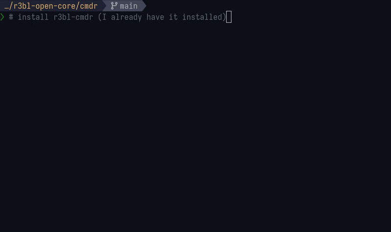
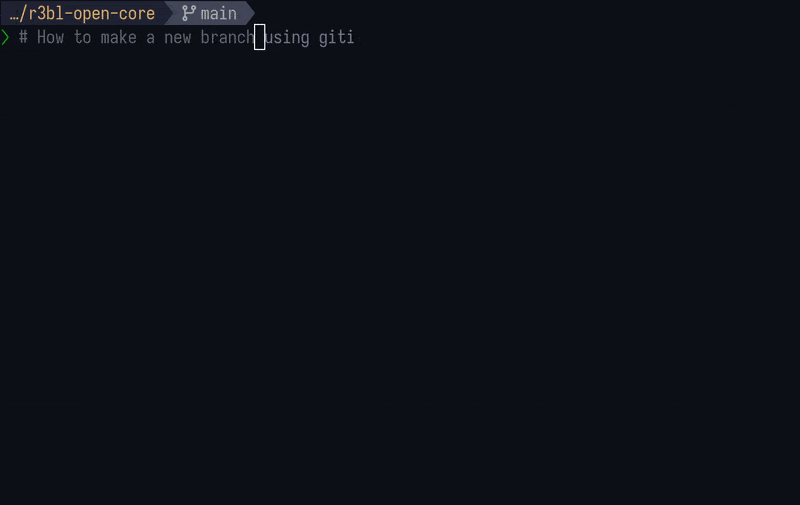

<p align="center">
  
</p>

# Suite of R3BL TUI apps focused on developer productivity
<a id="markdown-suite-of-r3bl-tui-apps-focused-on-developer-productivity" name="suite-of-r3bl-tui-apps-focused-on-developer-productivity"></a>

<!-- TOC -->

- [R3BL CMDR is comprised of two apps](#r3bl-cmdr-is-comprised-of-two-apps)
- [Install the apps on your system using cargo](#install-the-apps-on-your-system-using-cargo)
- [R3BL giti - perform version control with confidence](#r3bl-giti---perform-version-control-with-confidence)
  - [Commands that allow you to work with branches](#commands-that-allow-you-to-work-with-branches)
  - [See giti branch delete in action](#see-giti-branch-delete-in-action)
  - [See giti branch checkout in action](#see-giti-branch-checkout-in-action)
  - [See giti branch new in action](#see-giti-branch-new-in-action)
- [Run giti binary target](#run-giti-binary-target)
- [R3BL edi - edit Markdown files in your terminal in style](#r3bl-edi---edit-markdown-files-in-your-terminal-in-style)
- [Run edi binary target](#run-edi-binary-target)
- [Build, run, test tasks](#build-run-test-tasks)
  - [Prerequisites](#prerequisites)
  - [Nushell scripts to build, run, test etc.](#nushell-scripts-to-build-run-test-etc)

<!-- /TOC -->

## R3BL CMDR is comprised of two apps
<a id="markdown-r3bl-cmdr-is-comprised-of-two-apps" name="r3bl-cmdr-is-comprised-of-two-apps"></a>

1. [`giti`](#r3bl-giti---verison-control-with-confidence) 🐱 is an interactive CLI app to give you
   more confidence when working with git 💪.
2. [`edi`](#r3bl-edi---edit-markdown-files-in-your-terminal-in-style) 🦜 is a TUI Markdown editor
   that lets you edit Markdown files in your terminal in style 💖.

- These apps are currently available as 🐣 Early Access Preview.
- They run on **Linux, macOS and Windows**, and are written in Rust 🦀.

## Install the apps on your system using cargo
<a id="markdown-install-the-apps-on-your-system-using-cargo" name="install-the-apps-on-your-system-using-cargo"></a>

To install `r3bl-cmdr` on your system, run the following in your terminal:

```bash
cargo install r3bl-cmdr
```

> - 📦 You will need `cargo` installed on your system. If you don't have it, follow the instructions
>   [here](https://rustup.rs/) to install it.
> - 🐧 On Linux you will need `libssl-dev` installed on your system. On Ubuntu based systems, you
>   can get it by running `sudo apt install libssl-dev pkg-config`. For other distros, please refer
>   to this
>   [stackoverflow question](https://stackoverflow.com/questions/65553557/why-rust-is-failing-to-build-command-for-openssl-sys-v0-9-60-even-after-local-in).

## R3BL giti - perform version control with confidence
<a id="markdown-r3bl-giti---perform-version-control-with-confidence" name="r3bl-giti---perform-version-control-with-confidence"></a>

R3BL [`giti`](https://github.com/r3bl-org/r3bl-open-core/tree/main/cmdr/src/giti) 🐱 is an
interactive CLI app to give you more confidence when working with git 💪.

### Commands that allow you to work with branches
<a id="markdown-commands-that-allow-you-to-work-with-branches" name="commands-that-allow-you-to-work-with-branches"></a>

| Command                | Description                       |
| ---------------------- | --------------------------------- |
| `giti --help`          | See all the available commands    |
| `giti branch`          | List all the branch subcommands   |
| `giti branch delete`   | Delete one or more local branches |
| `giti branch checkout` | Checkout a branch                 |
| `giti branch new`      | Create a new branch               |

### See `giti branch delete` in action
<a id="markdown-see-giti-branch-delete-in-action" name="see-giti-branch-delete-in-action"></a>

R3BL giti 🐱: how to interactively delete multiple branches with giti: https://www.youtube.com/watch?v=aI550ZvuD0s


### See `giti branch checkout` in action
<a id="markdown-see-giti-branch-checkout-in-action" name="see-giti-branch-checkout-in-action"></a>

R3BL giti 🐱: how to interactively switch to a new branch using giti: https://youtu.be/pc4BP1GjFGo?si=J_2021-5g0XTuSPe



### See `giti branch new` in action
<a id="markdown-see-giti-branch-new-in-action" name="see-giti-branch-new-in-action"></a>

R3BL giti 🐱: how to interactively create a new branch with giti:
https://youtu.be/u_OqQyRQEZM?si=V4xt6xdAYNMz-2lb




## Run `giti` binary target
<a id="markdown-run-giti-binary-target" name="run-giti-binary-target"></a>

To run from binary:

- Run `cargo install r3bl-cmdr` (detailed instructions above). This will install `giti` locally to
  `~/.cargo/bin`.
- Run `giti` from anywhere on your system.
- Try `giti --help` to see the available commands.
- To delete one or more branches in your repo run `giti branch delete`.
- To checkout a branch run `giti branch checkout`.
- To create a new branch run `giti branch new`.

To run from source:

- Clone the `r3bl-open-core` repo.
- Go to the `cmdr` folder in your terminal.
- Run `nu run install` to install `giti` locally to `~/.cargo/bin`.
- Run `giti` from anywhere on your system.
- Try `giti --help` to see the available commands.
- To delete one or more branches in your repo run `giti branch delete`.
- To checkout a branch run `giti branch checkout`.
- To create a new branch run `giti branch new`.
- If you want to generate log output for `giti`, run `giti -l`. For example,
  `giti -l branch delete`. To view this log output run `nu run log`.

## R3BL edi - edit Markdown files in your terminal in style
<a id="markdown-r3bl-edi---edit-markdown-files-in-your-terminal-in-style" name="r3bl-edi---edit-markdown-files-in-your-terminal-in-style"></a>

🦜 [`edi`](https://github.com/r3bl-org/r3bl-open-core/tree/main/cmdr/src/edi) is a TUI Markdown
editor that lets you edit Markdown files in your terminal in style 💖.

## Run `edi` binary target
<a id="markdown-run-edi-binary-target" name="run-edi-binary-target"></a>

<!--
edi video
Source: https://github.com/nazmulidris/developerlife.com/issues/6
-->

https://github.com/nazmulidris/developerlife.com/assets/2966499/f2c4b07d-b5a2-4f41-af7a-06d1b6660c41

To run from binary:

- Run `cargo install r3bl-cmdr` (detailed instructions above). This will install `giti` locally to
  `~/.cargo/bin`.
- Run `edi` from anywhere on your system.
- Try `edi --help` to see the available commands.
- To open an existing file, run `edi <file_name>`. For example, `edi README.md`.

To run from source:

- Clone the `r3bl-open-core` repo.
- Go to the `cmdr` folder in your terminal.
- Run `nu run install` to install `edi` locally to `~/.cargo/bin`.
- Run `edi` from anywhere on your system.
- Try `edi --help` to see the available commands.
- To open an existing file, run `edi <file_name>`. For example, `edi README.md`.
- If you want to generate log output for `edi`, run `edi -l`. For example, `edi -l README.md`. To
  view this log output run `nu run log`.

## Build, run, test tasks
<a id="markdown-build%2C-run%2C-test-tasks" name="build%2C-run%2C-test-tasks"></a>

### Prerequisites
<a id="markdown-prerequisites" name="prerequisites"></a>

🌠 In order for these to work you have to install the Rust toolchain, `nu`, `cargo-watch`, `bat`,
and `flamegraph` on your system. Here are the instructions:

1. Install the Rust toolchain using `rustup` by following the instructions
   [here](https://rustup.rs/).
1. Install `cargo-watch` using `cargo install cargo-watch`.
1. Install `flamegraph` using `cargo install flamegraph`.
1. Install `bat` using `cargo install bat`.
1. Install [`nu`](https://crates.io/crates/nu) shell on your system using `cargo install nu`. It is
   available for Linux, macOS, and Windows.

### Nushell scripts to build, run, test etc.
<a id="markdown-nushell-scripts-to-build%2C-run%2C-test-etc." name="nushell-scripts-to-build%2C-run%2C-test-etc."></a>

| Command             | Description                                                                                                          |
| ------------------- | -------------------------------------------------------------------------------------------------------------------- |
| `nu run help`       | See all the commands you can pass to the `run` script                                                                |
| `nu run install`    | Install `giti`, `edi`, `rc` to `~/.cargo/bin`                                                                        |
| `nu run build`      | Build                                                                                                                |
| `nu run clean`      | Clean                                                                                                                |
| `nu run test`       | Run tests                                                                                                            |
| `nu run clippy`     | Run clippy                                                                                                           |
| `nu run log`        | View the log output. This [video](https://www.youtube.com/watch?v=Sy26IMkOEiM) has a walkthrough of how to use this. |
| `nu run docs`       | Build docs                                                                                                           |
| `nu run serve-docs` | Serve docs over VSCode Remote SSH session                                                                            |
| `nu run rustfmt`    | Run rustfmt                                                                                                          |

The following commands will watch for changes in the source folder and re-run:

| Command                                             | Description                        |
| --------------------------------------------------- | ---------------------------------- |
| `nu run watch-all-tests`                            | Watch all test                     |
| `nu run watch-one-test <test_name>`                 | Watch one test                     |
| `nu run watch-clippy`                               | Watch clippy                       |
| `nu run watch-macro-expansion-one-test <test_name>` | Watch macro expansion for one test |

There's also a `run` script at the **top level folder** of the repo. It is intended to be used in a
CI/CD environment w/ all the required arguments supplied or in interactive mode, where the user will
be prompted for input.

| Command                      | Description                                                                                                                                                                                                                                            |
| ---------------------------- | ------------------------------------------------------------------------------------------------------------------------------------------------------------------------------------------------------------------------------------------------------ |
| `nu run all`                 | Run all the tests, linting, formatting, etc. in one go. Used in CI/CD                                                                                                                                                                                  |
| `nu run build-full`          | This will build all the crates in the Rust workspace. And it will install all the required pre-requisite tools needed to work with this crate (what `install-cargo-tools` does) and clear the cargo cache, cleaning, and then do a really clean build. |
| `nu run install-cargo-tools` | This will install all the required pre-requisite tools needed to work with this crate (things like `cargo-deny`, `flamegraph` will all be installed in one go)                                                                                         |
| `nu run check-licenses`      | Use `cargo-deny` to audit all licenses used in the Rust workspace                                                                                                                                                                                      |
