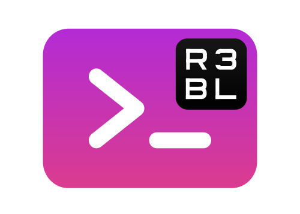

  

# r3bl-cmdr

<!-- TOC -->

- [Context](#context)
- [Run giti binary target](#run-giti-binary-target)
- [Run r3bl-cmdr or rc binary target](#run-r3bl-cmdr-or-rc-binary-target)
- [Build, run, test tasks](#build-run-test-tasks)
  - [Prerequisites](#prerequisites)
  - [Nu shell scripts to build, run, test etc.](#nu-shell-scripts-to-build-run-test-etc)

<!-- /TOC -->

## Context

<!-- R3BL TUI library & suite of apps focused on developer productivity -->

R3BL
TUI
library
&amp;
suite
of
apps
focused
on
developer
productivity

We are working on building command line apps in Rust which have rich text user interfaces (TUI). We
want to lean into the terminal as a place of productivity, and build all kinds of awesome apps for
it.

1. 🔮 Instead of just building one app, we are building a library to enable any kind of rich TUI
   development w/ a twist: taking concepts that work really well for the frontend mobile and web
   development world and re-imagining them for TUI & Rust.

   - Taking things like React, JSX, CSS, and Redux, but making everything async (they can be run in
     parallel & concurrent via Tokio).
   - Even the thread running the main event loop doesn't block since it is async.
   - Using proc macros to create DSLs to implement CSS & JSX.

2. 🌎 We are building apps to enhance developer productivity & workflows.

   - The idea here is not to rebuild tmux in Rust (separate processes mux'd onto a single terminal
     window). Rather it is to build a set of integrated "apps" (or "tasks") that run in the same
     process that renders to one terminal window.
   - Inside of this terminal window, we can implement things like "app" switching, routing, tiling
     layout, stacking layout, etc. so that we can manage a lot of TUI apps (which are tightly
     integrated) that are running in the same process, in the same window. So you can imagine that
     all these "app"s have shared application state (that is in a Redux store). Each "app" may also
     have its own Redux store.
   - Here are some examples of the types of "app"s we want to build:
     1. multi user text editors w/ syntax highlighting
     2. integrations w/ github issues
     3. integrations w/ calendar, email, contacts APIs

## Run `giti` binary target

1. Go to the `cmdr` folder in your terminal.
2. Run `nu run install` to install `giti` locally to `~/.cargo/bin`.
3. Run `giti` from anywhere on your system.
4. To delete one or more branches in your repo run `giti branch delete`.
5. If you want to generate log output for `giti`, run `giti -l`. For example, `giti -l
   branch delete`. To view this log output run `nu run log`.

## Run `edi` binary target

TODO: Add instructions here after `edi` is implemented.

## Run `r3bl-cmdr` or `rc` binary target

`r3bl-cmdr` is the second thing that's described above. It contains a set of apps for developers by
developers. It is engineered to enhance your:

- ❯ 🚀 productivity
- ❯ 🌍 efficiency
- ❯ 📖 knowledge capture & sharing
- ❯ 🛣️ workflow management

Our goal is to put a smile on your face every time you use this product.

## Build, run, test tasks

### Prerequisites

🌠 In order for these to work you have to install the Rust toolchain, `nu`, `cargo-watch`, `bat`,
and `flamegraph` on your system. Here are the instructions:

1. Install the Rust toolchain using `rustup` by following the instructions
   [here](https://rustup.rs/).
1. Install `cargo-watch` using `cargo install cargo-watch`.
1. Install `flamegraph` using `cargo install flamegraph`.
1. Install `bat` using `cargo install bat`.
1. Install [`nu`](https://crates.io/crates/nu) shell on your system using `cargo install nu`. It is
   available for Linux, macOS, and Windows.

### Nu shell scripts to build, run, test etc.

| Command                                | Description                                       |
| -------------------------------------- | ------------------------------------------------- |
| `nu run install`                       | Install `giti`, `edi`, `rc`  to `~/.cargo/bin`    |
| `nu run build`                         | Build                                             |
| `nu run clean`                         | Clean                                             |
| `nu run all`                           | All                                               |
| `nu run test`                          | Run tests                                         |
| `nu run clippy`                        | Run clippy                                        |
| `nu run docs`                          | Build docs                                        |
| `nu run serve-docs`                    | Serve docs over VSCode Remote SSH session         |
| `nu run rustfmt`                       | Run rustfmt                                       |

The following commands will watch for changes in the source folder and re-run:

| Command                                             | Description                        |
| --------------------------------------------------- | ---------------------------------- |
| `nu run watch-all-tests`                            | Watch all test                     |
| `nu run watch-one-test <test_name>`                 | Watch one test                     |
| `nu run watch-clippy`                               | Watch clippy                       |
| `nu run watch-macro-expansion-one-test <test_name>` | Watch macro expansion for one test |

There's also a `run` script at the **top level folder** of the repo. It is intended to
be used in a CI/CD environment w/ all the required arguments supplied or in
interactive mode, where the user will be prompted for input.

| Command                       | Description                        |
| ----------------------------- | ---------------------------------- |
| `nu run all`                  | Run all the tests, linting, formatting, etc. in one go. Used in CI/CD |
| `nu run build-full`           | This will build all the crates in the Rust workspace. And it will install all the required pre-requisite tools needed to work with this crate (what `install-cargo-tools` does) and clear the cargo cache, cleaning, and then do a really clean build. |
| `nu run install-cargo-tools`  | This will install all the required pre-requisite tools needed to work with this crate (things like `cargo-deny`, `flamegraph` will all be installed in one go) |
| `nu run check-licenses`       | Use `cargo-deny` to audit all licenses used in the Rust workspace |