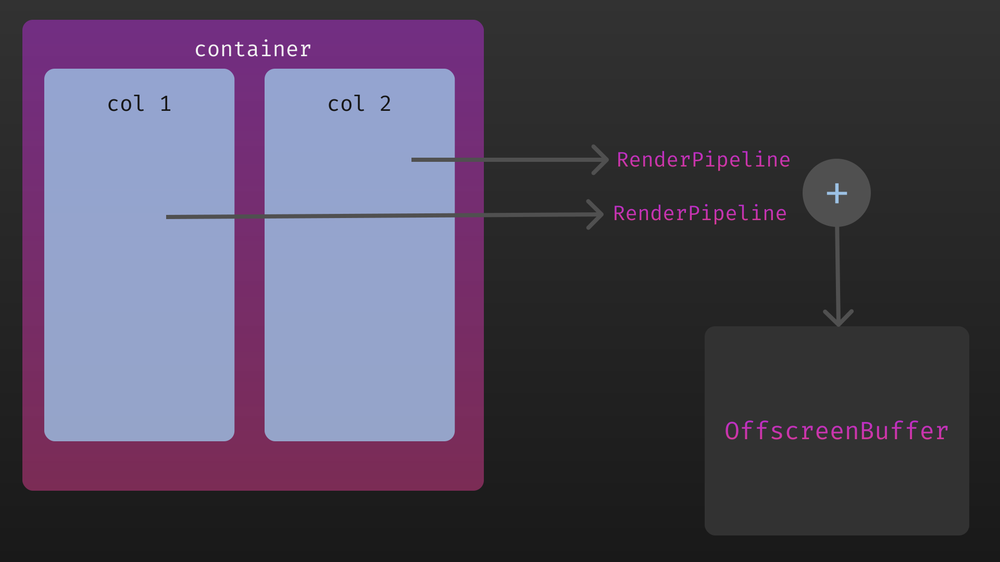

<p align="center">
  
</p>

# Context

<a id="markdown-context" name="context"></a>

<!-- R3BL TUI library & suite of apps focused on developer productivity -->

<span style="color:#FD2F53">R</span><span style="color:#FC2C57">3</span><span style="color:#FB295B">B</span><span style="color:#FA265F">L</span><span style="color:#F92363">
</span><span style="color:#F82067">T</span><span style="color:#F61D6B">U</span><span style="color:#F51A6F">I</span><span style="color:#F31874">
</span><span style="color:#F11678">l</span><span style="color:#EF137C">i</span><span style="color:#ED1180">b</span><span style="color:#EB0F84">r</span><span style="color:#E90D89">a</span><span style="color:#E60B8D">r</span><span style="color:#E40A91">y</span><span style="color:#E10895">
</span><span style="color:#DE0799">&amp;</span><span style="color:#DB069E">
</span><span style="color:#D804A2">s</span><span style="color:#D503A6">u</span><span style="color:#D203AA">i</span><span style="color:#CF02AE">t</span><span style="color:#CB01B2">e</span><span style="color:#C801B6">
</span><span style="color:#C501B9">o</span><span style="color:#C101BD">f</span><span style="color:#BD01C1">
</span><span style="color:#BA01C4">a</span><span style="color:#B601C8">p</span><span style="color:#B201CB">p</span><span style="color:#AE02CF">s</span><span style="color:#AA03D2">
</span><span style="color:#A603D5">f</span><span style="color:#A204D8">o</span><span style="color:#9E06DB">c</span><span style="color:#9A07DE">u</span><span style="color:#9608E1">s</span><span style="color:#910AE3">e</span><span style="color:#8D0BE6">d</span><span style="color:#890DE8">
</span><span style="color:#850FEB">o</span><span style="color:#8111ED">n</span><span style="color:#7C13EF">
</span><span style="color:#7815F1">d</span><span style="color:#7418F3">e</span><span style="color:#701AF5">v</span><span style="color:#6B1DF6">e</span><span style="color:#6720F8">l</span><span style="color:#6322F9">o</span><span style="color:#5F25FA">p</span><span style="color:#5B28FB">e</span><span style="color:#572CFC">r</span><span style="color:#532FFD">
</span><span style="color:#4F32FD">p</span><span style="color:#4B36FE">r</span><span style="color:#4739FE">o</span><span style="color:#443DFE">d</span><span style="color:#4040FE">u</span><span style="color:#3C44FE">c</span><span style="color:#3948FE">t</span><span style="color:#354CFE">i</span><span style="color:#324FFD">v</span><span style="color:#2E53FD">i</span><span style="color:#2B57FC">t</span><span style="color:#285BFB">y</span>

We are working on building command line apps in Rust which have rich text user interfaces (TUI). We
want to lean into the terminal as a place of productivity, and build all kinds of awesome apps for
it.

1. 🔮 Instead of just building one app, we are building a library to enable any kind of rich TUI
   development w/ a twist: taking concepts that work really well for the frontend mobile and web
   development world and re-imagining them for TUI & Rust.

   - Taking things like React, JSX, CSS, and Redux, but making everything async (they can be run in
     parallel & concurrent via Tokio).
   - Even the thread running the main event loop doesn't block since it is async.
   - Using proc macros to create DSLs to implement CSS & JSX.

2. 🌎 We are building apps to enhance developer productivity & workflows.

   - The idea here is not to rebuild tmux in Rust (separate processes mux'd onto a single terminal
     window). Rather it is to build a set of integrated "apps" (or "tasks") that run in the same
     process that renders to one terminal window.
   - Inside of this terminal window, we can implement things like "app" switching, routing, tiling
     layout, stacking layout, etc. so that we can manage a lot of TUI apps (which are tightly
     integrated) that are running in the same process, in the same window. So you can imagine that
     all these "app"s have shared application state (that is in a Redux store). Each "app" may also
     have its own Redux store.
   - Here are some examples of the types of "app"s we want to build:
     1. multi user text editors w/ syntax highlighting
     2. integrations w/ github issues
     3. integrations w/ calendar, email, contacts APIs

# r3bl_tui crate

<a id="markdown-r3bl_tui-crate" name="r3bl_tui-crate"></a>

This crate is related to the first thing that's described above. It provides lots of useful
functionality to help you build TUI (text user interface) apps, along w/ general niceties &
ergonomics that all Rustaceans 🦀 can enjoy 🎉:

<!-- TOC depthfrom:2 updateonsave:true orderedlist:false insertanchor:true -->

- [Text User Interface engine for Rust](#text-user-interface-engine-for-rust)
- [Examples to get you started](#examples-to-get-you-started)
- [Life of an input event](#life-of-an-input-event)
- [The window](#the-window)
- [Layout and styling](#layout-and-styling)
- [Component, ComponentRegistry, focus management, and event routing](#component-componentregistry-focus-management-and-event-routing)
- [Input event specificity](#input-event-specificity)
- [Rendering and painting](#rendering-and-painting)
  - [Offscreen buffer](#offscreen-buffer)
  - [Render pipeline](#render-pipeline)
  - [First render](#first-render)
  - [Subsequent render](#subsequent-render)
- [Redux for state management](#redux-for-state-management)
- [Grapheme support](#grapheme-support)
- [Lolcat support](#lolcat-support)
- [Other crates that depend on this](#other-crates-that-depend-on-this)
- [Issues, comments, feedback, and PRs](#issues-comments-feedback-and-prs)

<!-- /TOC -->

## Text User Interface engine for Rust

<a id="markdown-text-user-interface-engine-for-rust" name="text-user-interface-engine-for-rust"></a>

You can build fully async TUI (text user interface) apps with a modern API that brings the best of
the web frontend development ideas to TUI apps written in Rust:

1. Reactive & unidirectional data flow architecture from frontend web development (React, Redux).
2. Responsive design w/ CSS, flexbox like concepts.
3. Declarative style of expressing styling and layouts.

And since this is using Rust and Tokio you get the advantages of concurrency and parallelism
built-in. No more blocking the main thread for user input, for async middleware, or even rendering
🎉.

> This framework is
> [loosely coupled and strongly coherent](https://developerlife.com/2015/11/05/loosely-coupled-strongly-coherent/)
> meaning that you can pick and choose whatever pieces you would like to use w/out having the
> cognitive load of having to grok all the things in the codebase. Its more like a collection of
> mostly independent modules that work well w/ each other, but know very little about each other.

Here are some framework highlights:

- An easy to use and approachable API that is inspired by React, JSX, CSS, and Redux. Lots of
  components and things are provided for you so you don't have to build them from scratch. This is a
  full featured component library including:
  - Redux for state management (fully async, concurrent & parallel).
  - CSS like declarative styling engine.
  - CSS flexbox like declarative layout engine which is fully responsive. You can resize your
    terminal window and everything will be laid out correctly.
  - A terminal independent underlying rendering and painting engine (can use crossterm or termion or
    whatever you want).
  - Text editor w/ syntax highlighting support.
  - Modal dialog boxes.
  - Lolcat implementation w/ a rainbow color-wheel palette.
  - Support for Unicode grapheme clusters in strings. You can safely use emojis, and other Unicode
    characters in your TUI apps.
  - Support for ANSI text.
  - Support for mouse events.
- The entire TUI framework itself supports concurrency & parallelism (user input, rendering, etc.
  are generally non blocking).
- It is fast! There are no needless re-renders, or flickering. Animations and color changes are
  smooth (check this out for yourself by running the examples). You can even build your TUI in
  layers (like z-order in a browser's DOM).

## Examples to get you started

<a id="markdown-examples-to-get-you-started" name="examples-to-get-you-started"></a>

<!-- How to upload video: https://stackoverflow.com/a/68269430/2085356 -->

Here's a video of the demo in action:

https://user-images.githubusercontent.com/2966499/206881196-37cf1220-8c1b-460e-a2cb-7e06d22d6a02.mp4

1. You can run `cargo run --example demo` in the `tui/examples` folder to see a demo of the library
   in action and play with it. The examples cover the entire surface area of the TUI API. You can
   also take a look at the tests in the source as well `tui/src/`.

2. The design docs and architecture diagrams in the
   [`docs` folder](https://github.com/r3bl-org/r3bl_rs_utils/tree/main/docs) are a good place to
   start to get a feel for the architecture of the framework. You can get a mental model of how
   everything fits and what the TUI lifecycle is.

3. Additionally the [r3bl_rs_utils_core](https://crates.io/crates/r3bl_rs_utils_core) has the
   `tui_core` module which contains dependencies that are used by the `tui` module. They include:
   1. ANSI text support.
   2. Core dimensions and units that are used for positioning and sizing.
   3. Grapheme cluster segment and unicode support (emoji support).
   4. Lolcat support.
   5. CSS like styling support.

> Quite a few scripts are provided for your convenience in the root folder of the repo. They are all
> `fish` script files. Here are a few worth mentioning here which are related to running the
> example.
>
> 1. `run.fish`: This will simply run the examples. You can watch the logs by running `log.fish`.
> 2. `run-with-flamegraph-profiling.fish`: This will run the examples and generate a flamegraph at
>    the end so you can see profile the performance of the app.
> 3. `run-with-crash-reporting.fish`: This will run the examples and generate a `crash_log.txt` file
>    (in the `tui` folder) in case the app crashes. This is useful for debugging.

## Life of an input event

<a id="markdown-life-of-an-input-event" name="life-of-an-input-event"></a>

There is a clear separation of concerns in this module. To illustrate what goes where, and how
things work let's look at an example that puts the main event loop front and center & deals w/ how
the system handles an input event (key press or mouse).

- The diagram below shows an app that has 3 [Component]s for (flexbox like) layout & (CSS like)
  styling.
- Let's say that you run this app (by hypothetically executing `cargo run`).
- And then you click or type something in the terminal window that you're running this app in.

```text
🧍⌨️🖱️
input → [TerminalWindow]
event       ↑      ↓               [ComponentRegistry] creates
            ┊   [App] ───────────■ [Component]s at 1st render
            ┊      │
            ┊      │        ┌──────■ id=1 has focus
            ┊      │        │
            ┊      ├→ [Component] id=1 ───┐
            ┊      ├→ [Component] id=2    │
            ┊      └→ [Component] id=3    │
         default                          │
         handler  ←───────────────────────┘
```

Let's trace the journey through the diagram when an input even is generated by the user (eg: a key
press, or mouse event). When the app is started via `cargo run` it sets up a main loop, and lays out
all the 3 components, sizes, positions, and then paints them. Then it asynchronously listens for
input events (no threads are blocked). When the user types something, this input is processed by the
main loop of [TerminalWindow].

1.  The [Component] that is in [FlexBox] w/ `id=1` currently has focus.
2.  When an input event comes in from the user (key press or mouse input) it is routed to the [App]
    first, before [TerminalWindow] looks at the event.
3.  The specificity of the event handler in [App] is higher than the default input handler in
    [TerminalWindow]. Further, the specificity of the [Component] that currently has focus is the
    highest. In other words, the input event gets routed by the [App] to the [Component] that
    currently has focus ([Component] id=1 in our example).
4.  Since it is not guaranteed that some [Component] will have focus, this input event can then be
    handled by [App], and if not, then by [TerminalWindow]'s default handler. If the default handler
    doesn't process it, then it is simply ignored.
5.  In this journey, as the input event is moved between all these different entities, each entity
    decides whether it wants to handle the input event or not. If it does, then it returns an enum
    indicating that the event has been consumed, else, it returns an enum that indicates the event
    should be propagated.

Now that we have seen this whirlwind overview of the life of an input event, let's look at the
details in each of the sections below.

Here's an architecture diagram that will be useful to keep in mind as we go through the details of
the following sections:


## The window

<a id="markdown-the-window" name="the-window"></a>

The main building blocks of a TUI app are:

1.  [TerminalWindow] - You can think of this as the main "window" of the app. All the content of
    your app is painted inside of this "window". And the "window" conceptually maps to the screen
    that is contained inside your terminal emulator program (eg: tilix, Terminal.app, etc). Your TUI
    app will end up taking up 100% of the screen space of this terminal emulator. It will also enter
    raw mode, and paint to an alternate screen buffer, leaving your original scroll back buffer and
    history intact. When you exit this TUI app, it will return your terminal to where you'd left
    off. You don't write this code, this is something that you use.
2.  [App] - This is where you write your code. You pass in a [App] to the [TerminalWindow] to
    bootstrap your TUI app. You can just use [App] to build your app, if it is a simple one & you
    don't really need any sophisticated layout or styling. But if you want layout and styling, now
    we have to deal with [FlexBox], [Component], and [crate::Style].

## Layout and styling

<a id="markdown-layout-and-styling" name="layout-and-styling"></a>

Inside of your [App] if you want to use flexbox like layout and CSS like styling you can think of
composing your code in the following way:

1.  [App] is like a box or container. You can attach styles and an id here. The id has to be unique,
    and you can reference as many styles as you want from your stylesheet. Yes, cascading styles are
    supported! 👏 You can put boxes inside of boxes. You can make a container box and inside of that
    you can add other boxes (you can give them a direction and even relative sizing out of 100%).
2.  As you approach the "leaf" nodes of your layout, you will find [Component] trait objects. These
    are black boxes which are sized, positioned, and painted _relative_ to their parent box. They
    get to handle input events and render [RenderOp]s into a [RenderPipeline]. This is kind of like
    virtual DOM in React. This queue of commands is collected from all the components and ultimately
    painted to the screen, for each render! You can also use Redux to maintain your app's state, and
    dispatch actions to the store, and even have async middleware!

## Component, ComponentRegistry, focus management, and event routing

<a id="markdown-component%2C-componentregistry%2C-focus-management%2C-and-event-routing" name="component%2C-componentregistry%2C-focus-management%2C-and-event-routing"></a>

Typically your [App] will look like this:

```rust
/// Async trait object that implements the [App] trait.
#[derive(Default)]
pub struct AppWithLayout {
  pub component_registry: ComponentRegistry<AppWithLayoutState, AppWithLayoutAction>,
  pub has_focus: HasFocus,
}
```

As we look at [Component] & [App] more closely we will find a curious thing [ComponentRegistry]
(that is managed by the [App]). The reason this exists is for input event routing. The input events
are routed to the [Component] that currently has focus.

The [HasFocus] struct takes care of this. This provides 2 things:

1.  It holds an `id` of a [FlexBox] / [Component] that has focus.
2.  It also holds a map that holds a [crate::Position] for each `id`. This is used to represent a
    cursor (whatever that means to your app & component). This cursor is maintained for each `id`.
    This allows a separate cursor for each [Component] that has focus. This is needed to build apps
    like editors and viewers that maintains a cursor position between focus switches.

Another thing to keep in mind is that the [App] and [TerminalWindow] is persistent between
re-renders. The Redux store is also persistent between re-renders.

## Input event specificity

<a id="markdown-input-event-specificity" name="input-event-specificity"></a>

[TerminalWindow] gives [Component] first dibs when it comes to handling input events. If it punts
handling this event, it will be handled by the default input event handler. And if nothing there
matches this event, then it is simply dropped.

## Rendering and painting

<a id="markdown-rendering-and-painting" name="rendering-and-painting"></a>

The R3BL TUI engine uses a high performance compositor to render the UI to the terminal. This
ensures that only "pixels" that have changed are painted to the terminal. This is done by creating a
concept of `PixelChar` which represents a single "pixel" in the terminal screen at a given col and
row index position. There are only as many `PixelChar`s as there are rows and cols in a terminal
screen. And the index maps directly to the position of the pixel in the terminal screen.

### Offscreen buffer

<a id="markdown-offscreen-buffer" name="offscreen-buffer"></a>

Here is an example of what a single row of rendered output might look like in a row of the
`OffscreenBuffer`. This diagram shows each `PixelChar` in `row_index: 1` of the `OffscreenBuffer`.
In this example, there are 80 columns in the terminal screen. This actual log output generated by
the TUI engine when logging is enabled.

```text
row_index: 1
000 S ░░░░░░░╳░░░░░░░░001 P    'j'→fg‐bg    002 P    'a'→fg‐bg    003 P    'l'→fg‐bg    004 P    'd'→fg‐bg    005 P    'k'→fg‐bg
006 P    'f'→fg‐bg    007 P    'j'→fg‐bg    008 P    'a'→fg‐bg    009 P    'l'→fg‐bg    010 P    'd'→fg‐bg    011 P    'k'→fg‐bg
012 P    'f'→fg‐bg    013 P    'j'→fg‐bg    014 P    'a'→fg‐bg    015 P     '▒'→rev     016 S ░░░░░░░╳░░░░░░░░017 S ░░░░░░░╳░░░░░░░░
018 S ░░░░░░░╳░░░░░░░░019 S ░░░░░░░╳░░░░░░░░020 S ░░░░░░░╳░░░░░░░░021 S ░░░░░░░╳░░░░░░░░022 S ░░░░░░░╳░░░░░░░░023 S ░░░░░░░╳░░░░░░░░
024 S ░░░░░░░╳░░░░░░░░025 S ░░░░░░░╳░░░░░░░░026 S ░░░░░░░╳░░░░░░░░027 S ░░░░░░░╳░░░░░░░░028 S ░░░░░░░╳░░░░░░░░029 S ░░░░░░░╳░░░░░░░░
030 S ░░░░░░░╳░░░░░░░░031 S ░░░░░░░╳░░░░░░░░032 S ░░░░░░░╳░░░░░░░░033 S ░░░░░░░╳░░░░░░░░034 S ░░░░░░░╳░░░░░░░░035 S ░░░░░░░╳░░░░░░░░
036 S ░░░░░░░╳░░░░░░░░037 S ░░░░░░░╳░░░░░░░░038 S ░░░░░░░╳░░░░░░░░039 S ░░░░░░░╳░░░░░░░░040 S ░░░░░░░╳░░░░░░░░041 S ░░░░░░░╳░░░░░░░░
042 S ░░░░░░░╳░░░░░░░░043 S ░░░░░░░╳░░░░░░░░044 S ░░░░░░░╳░░░░░░░░045 S ░░░░░░░╳░░░░░░░░046 S ░░░░░░░╳░░░░░░░░047 S ░░░░░░░╳░░░░░░░░
048 S ░░░░░░░╳░░░░░░░░049 S ░░░░░░░╳░░░░░░░░050 S ░░░░░░░╳░░░░░░░░051 S ░░░░░░░╳░░░░░░░░052 S ░░░░░░░╳░░░░░░░░053 S ░░░░░░░╳░░░░░░░░
054 S ░░░░░░░╳░░░░░░░░055 S ░░░░░░░╳░░░░░░░░056 S ░░░░░░░╳░░░░░░░░057 S ░░░░░░░╳░░░░░░░░058 S ░░░░░░░╳░░░░░░░░059 S ░░░░░░░╳░░░░░░░░
060 S ░░░░░░░╳░░░░░░░░061 S ░░░░░░░╳░░░░░░░░062 S ░░░░░░░╳░░░░░░░░063 S ░░░░░░░╳░░░░░░░░064 S ░░░░░░░╳░░░░░░░░065 S ░░░░░░░╳░░░░░░░░
066 S ░░░░░░░╳░░░░░░░░067 S ░░░░░░░╳░░░░░░░░068 S ░░░░░░░╳░░░░░░░░069 S ░░░░░░░╳░░░░░░░░070 S ░░░░░░░╳░░░░░░░░071 S ░░░░░░░╳░░░░░░░░
072 S ░░░░░░░╳░░░░░░░░073 S ░░░░░░░╳░░░░░░░░074 S ░░░░░░░╳░░░░░░░░075 S ░░░░░░░╳░░░░░░░░076 S ░░░░░░░╳░░░░░░░░077 S ░░░░░░░╳░░░░░░░░
078 S ░░░░░░░╳░░░░░░░░079 S ░░░░░░░╳░░░░░░░░080 S ░░░░░░░╳░░░░░░░░spacer [ 0, 16-80 ]
```

When `RenderOps` are executed and used to create an `OffscreenBuffer` that maps to the size of the
terminal window, clipping is performed automatically. This means that it isn't possible to move the
caret outside of the bounds of the viewport (terminal window size). And it isn't possible to paint
text that is larger than the size of the offscreen buffer. The buffer really represents the current
state of the viewport. Scrolling has to be handled by the component itself (an example of this is
the editor component).

Each `PixelChar` can be one of 4 things:

1. **Space**. This is just an empty space. There is no flickering in the TUI engine. When a new
   offscreen buffer is created, it is fulled w/ spaces. Then components paint over the spaces. Then
   the diffing algorithm only paints over the pixels that have changed. You don't have to worry
   about clearing the screen and painting, which typically will cause flickering in terminals. You
   also don't have to worry about printing empty spaces over areas that you would like to clear
   between renders. All of this handled by the TUI engine.
2. **Void**. This is a special pixel that is used to indicate that the pixel should be ignored. It
   is used to indicate a wide emoji is to the left somewhere. Most terminals don't support emojis,
   so there's a discrepancy between the display width of the character and its index in the string.
3. **Plain text**. This is a normal pixel which wraps a single character that maybe a grapheme
   cluster segment. Styling information is encoded in each `PixelChar::PlainText` and is used to
   paint the screen via the diffing algorithm which is smart enough to "stack" styles that appear
   beside each other for quicker rendering in terminals.
4. **ANSI text**. Styling information in not available w/ these characters because the styling
   information is encoded in the ANSI escape codes. `lolcat_api.rs` generates these ANSI strings for
   the rainbow effect. An example of this is the outline around a modal dialog box.

### Render pipeline

<a id="markdown-render-pipeline" name="render-pipeline"></a>

The following diagram provides a high level overview of how apps (that contain components, which may
contain components, and so on) are rendered to the terminal screen.



Each component produces a `RenderPipeline`, which is a map of `ZOrder` and `Vec<RenderOps>`.
`RenderOps` are the instructions that are grouped together, such as move the caret to a position,
set a color, and paint some text.

Inside of each `RenderOps` the caret is stateful, meaning that the caret position is remembered
after each `RenderOp` is executed. However, once a new `RenderOps` is executed, the caret position
reset just for that `RenderOps`. Caret position is not stored globally. You should read more about
"atomic paint operations" in the `RenderOp` documentation.

Once a set of these `RenderPipeline`s have been generated, typically after the user enters some
input event, and that produces a new state which then has to be rendered, they are combined and
painted into an `OffscreenBuffer`.

### First render

<a id="markdown-first-render" name="first-render"></a>

The `paint.rs` file contains the `paint` function, which is the entry point for all rendering. Once
the first render occurs, the `OffscreenBuffer` that is generated is saved to `GlobalSharedState`.
The following table shows the various tasks that have to be performed in order to render to an
`OffscreenBuffer`. There is a different code path that is taken for ANSI text and plain text (which
includes `StyledText` which is just plain text with a color). Syntax highlighted text is also just
`StyledText`. The ANSI text is an example of text that is generated by the `lolcat_api.rs`.

| UTF-8 | ANSI | Task                                                                                                    |
| ----- | ---- | ------------------------------------------------------------------------------------------------------- |
| Y     | Y    | convert `RenderPipeline` to `List<List<PixelChar>>` (`OffscreenBuffer`)                                 |
| Y     | Y    | paint each `PixelChar` in `List<List<PixelChar>>` to stdout using `OffscreenBufferPainterImplCrossterm` |
| Y     | Y    | save the `List<List<PixelChar>>` to `GlobalSharedState`                                                 |

Currently only `crossterm` is supported for actually painting to the terminal. But this process is
really simple making it very easy to swap out other terminal libraries such as `termion`, or even a
GUI backend, or some other custom output driver.

### Subsequent render

<a id="markdown-subsequent-render" name="subsequent-render"></a>

Since the `OffscreenBuffer` is cached in `GlobalSharedState` a diff to be performed for subsequent
renders. And only those diff chunks are painted to the screen. This ensures that there is no flicker
when the content of the screen changes. It also minimizes the amount of work that the terminal or
terminal emulator has to do put the `PixelChar`s on the screen.

## Redux for state management

<a id="markdown-redux-for-state-management" name="redux-for-state-management"></a>

If you use Redux for state management, then you will create a [crate::redux] [crate::Store] that is
passed into the [TerminalWindow]. Here's an example of this.

```rust
use crossterm::event::*;
use r3bl_rs_utils::*;
use super::*;

const DEBUG: bool = true;

pub async fn run_app() -> CommonResult<()> {
  throws!({
    if DEBUG {
      try_to_set_log_level(log::LevelFilter::Trace)?;
    } else {
      try_to_set_log_level(log::LevelFilter::Off)?;
    }

    // Create store.
    let store = create_store().await;

    // Create an App (renders & responds to user input).
    let shared_app = AppWithLayout::new_shared();

    // Exit if these keys are pressed.
    let exit_keys: Vec<KeyEvent> = vec![KeyEvent {
      code: KeyCode::Char('q'),
      modifiers: KeyModifiers::CONTROL,
    }];

    // Create a window.
    TerminalWindow::main_event_loop(store, shared_app, exit_keys).await?
  });
}

async fn create_store() -> Store<AppWithLayoutState, AppWithLayoutAction> {
  let mut store: Store<AppWithLayoutState, AppWithLayoutAction> = Store::default();
  store.add_reducer(AppReducer::new()).await;
  store
}
```

## Grapheme support

<a id="markdown-grapheme-support" name="grapheme-support"></a>

Unicode is supported (to an extent). There are some caveats. The [crate::UnicodeStringExt] trait has
lots of great information on this graphemes and what is supported and what is not.

## Lolcat support

<a id="markdown-lolcat-support" name="lolcat-support"></a>

An implementation of [crate::lolcat::cat] w/ a color wheel is provided.

## Other crates that depend on this

<a id="markdown-other-crates-that-depend-on-this" name="other-crates-that-depend-on-this"></a>

This crate is a dependency of the following crates:

1. [`r3bl_rs_utils`](https://crates.io/crates/r3bl_rs_utils) crates (the "main" library)

## Issues, comments, feedback, and PRs

<a id="markdown-issues%2C-comments%2C-feedback%2C-and-prs" name="issues%2C-comments%2C-feedback%2C-and-prs"></a>

Please report any issues to the [issue tracker](https://github.com/r3bl-org/r3bl-rs-utils/issues).
And if you have any feature requests, feel free to add them there too 👍.
